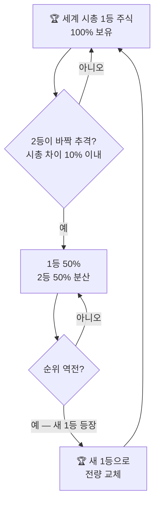
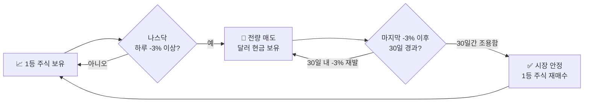
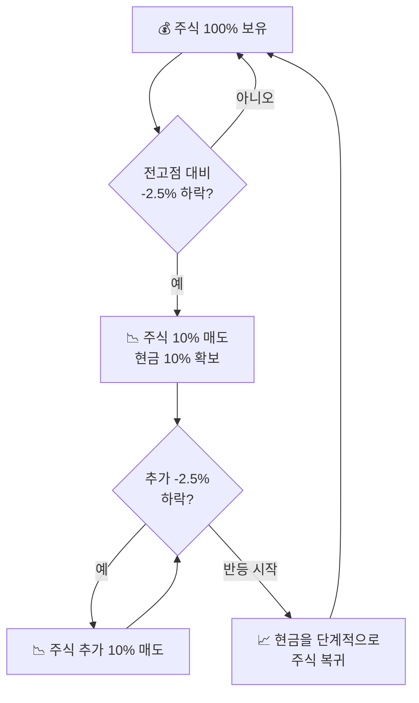
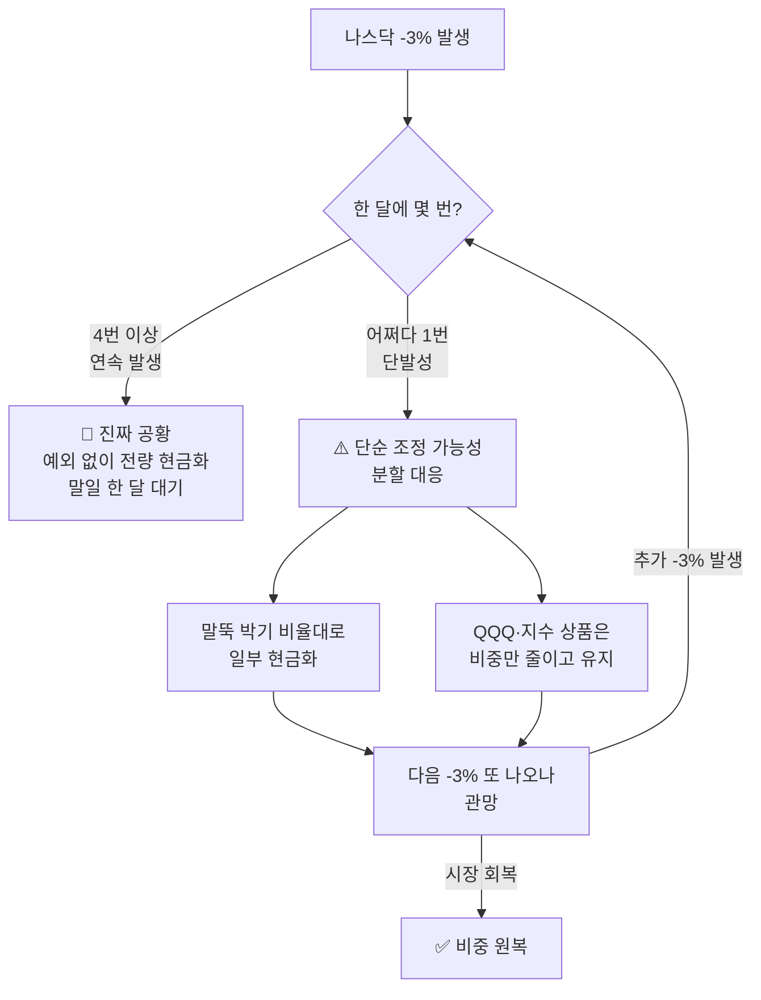
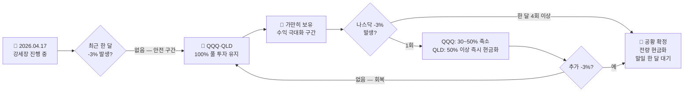

## 📊 조던(김장섭)의 일등주식 투자법

복잡한 경제 지표 대신 **세계 1등 기업 시가총액**과 **나스닥 지수**라는
두 가지 명확한 기준만으로 리스크를 관리하고 수익을 극대화하는 전략입니다.

::: key
**💡 핵심 철학** — "세상의 돈은 결국 가장 힘이 센 1등에게 몰린다."
수익을 내는 것보다 **잃지 않는 것이 먼저**입니다.
:::

---

## 1️⃣ 투자 대상 — 무조건 세계 시총 1등

주식 시장에서 가장 안전하고 강력한 주식은 **전 세계 시가총액 1위 기업**입니다.
현재 기준으로는 애플, 마이크로소프트, 엔비디아 등이 해당됩니다.

  

    <h4>✅ 1등 기업의 강점</h4>
    <ul>
      <li>위기 상황에서도 가장 잘 버팀</li>
      <li>호황기에는 시장을 선도</li>
      <li>전 세계 자금이 집중되는 구조</li>
      <li>초보자도 종목 선택 고민 불필요</li>
    </ul>
  

  

    <h4>🔄 종목 교체 기준</h4>
    <ul>
      <li>2등이 1등과 시총 차이 <strong>10% 이내</strong>로 좁혀지면</li>
      <li>1등 50% : 2등 50% 분산 보유</li>
      <li>순위가 완전히 뒤바뀌면</li>
      <li>전량 새 1등으로 갈아탐</li>
    </ul>
  

---

## 2️⃣ 매도 타이밍 — 나스닥 -3% 법칙

이 투자법의 핵심 안전장치입니다. 시장 대폭락을 피하기 위한 **자동 비상구**입니다.

::: warning
**📉 나스닥 하루 -3% 이상 하락 시** → 보유 주식 전량 즉시 매도 후 달러(현금) 대기
:::

::: analogy 🧒 태풍 대피 비유
일기 예보에서 태풍 경보(나스닥 -3%)가 뜨면 즉시 대피소(현금)로 피합니다.
한 달 동안 태풍이 없으면 다시 집(주식)으로 돌아옵니다.
태풍이 지나가는 동안 집이 무너져도 나는 안전합니다.
:::

### '말일 한 달' 규칙

| 상황 | 행동 |
|------|------|
| 나스닥 -3% 발생 | 즉시 전량 매도 |
| 이후 30일 내 -3% 재발 | 카운트 리셋, 계속 현금 대기 |
| 마지막 -3%로부터 30일 경과 | 1등 주식 재매수 |

---

## 3️⃣ 리밸런싱 — 말뚝 박기

주가 하락 시 기계적으로 대응해 자산이 녹아내리는 것을 방지하는 **헤지 전략**입니다.

::: formula 말뚝 박기 규칙
전고점 대비 -2.5% 하락마다 → 주식 비중 10% 현금화
반등 시 → 현금을 단계적으로 주식으로 복귀
:::

::: analogy 🧒 모래주머니 비유
홍수(하락장)가 오면 모래주머니(현금)를 하나씩 쌓습니다.
물이 빠지기 시작하면(반등) 모래주머니를 하나씩 치웁니다.
한꺼번에 다 쌓거나 다 치우는 게 아니라 **단계적으로** 대응하는 것이 핵심입니다.
:::

---

## 4️⃣ 시나리오별 행동 지침

| 상황 | 행동 지침 | 이유 |
|------|---------|------|
| **평상시** | 세계 시총 1등 100% 보유 | 1등은 장기 우상향 |
| **나스닥 -3% 발생** | 즉시 전량 매도 → 달러 대기 | 대폭락 전조 신호 |
| **한 달간 -3% 없음** | 1등 주식 재매수 | 시장 안정 판단 |
| **2등이 10% 내로 추격** | 1등 50% : 2등 50% 분산 | 순위 교체 과도기 |
| **전고점 대비 -2.5% 하락** | 주식 10% 현금화 | 하락 리스크 헤지 |

---

## 5️⃣ 전략 요약

::: steps
1. **종목 선택** — 전 세계 시총 1등 주식만 보유합니다. 분석 불필요, 기준이 명확합니다.
2. **하락 신호 감지** — 나스닥이 하루 -3% 이상 떨어지면 즉시 전량 매도합니다.
3. **현금 대기** — 마지막 -3% 이후 30일간 조용하면 다시 매수합니다.
4. **단계적 헤지** — 전고점 대비 -2.5%마다 10%씩 현금화해 하락을 방어합니다.
5. **1등 교체** — 시총 순위가 바뀌면 새 1등으로 전량 갈아탑니다.
:::

  

    <h4>✅ 이 전략의 장점</h4>
    <ul>
      <li>감정 배제 — 기계적 원칙 매매</li>
      <li>초보자도 실행 가능한 명확한 기준</li>
      <li>대형 하락장에서 자산 보호</li>
      <li>종목 분석 없이 1등만 추적</li>
    </ul>
  

  

    <h4>⚠️ 주의할 점</h4>
    <ul>
      <li>잦은 매매 시 양도소득세·수수료 발생</li>
      <li>-3% 발생 시 즉시 실행하는 규율 필요</li>
      <li>단기 반등 후 재하락 시 손실 발생 가능</li>
      <li>원칙을 어기는 순간 전략이 무너짐</li>
    </ul>
  

::: key
**💡 핵심 결론** — 이 전략은 "내가 시장보다 똑똑할 수 없다"는 것을 인정하고,
철저히 **데이터(시가총액, 지수 하락률)에 기반해 움직이는** 규칙 기반 투자법입니다.
원칙만 지키면 큰 손실을 피하면서 시장 수익률을 따라갈 수 있습니다.
:::

---

## 🔄 업데이트된 전략 — 분할 대응으로 진화

최근 조던 소장의 매뉴얼은 **"무조건 전량 매도"에서 "상황별 비중 조절"** 방식으로 진화했습니다.
QQQ·QLD 같은 지수 상품이 포트폴리오에 추가되면서 세분화된 것입니다.

### 핵심 변화: 공황 vs 단순 조정 구분

::: warning
**나스닥 -3% = 공황 예고** (과거) → **나스닥 -3% = 리스크 관리 시작** (현재)
:::

### 종목별 차등 대응

| 보유 종목 | -3% 1회 | -3% 4회 이상 (공황) |
|---------|--------|-----------------|
| **개별 1등주** (애플·엔비디아 등) | 엄격하게 비중 축소 | 전량 매도 |
| **QQQ** (나스닥 지수) | 말뚝 박기 비율 조절 | 전량 매도 |
| **QLD** (2배 레버리지) | 50% 선 매도 후 관망 | 전량 매도 |

### QLD(2배 레버리지) 적용 시 주의사항

::: info
QLD는 변동성이 2배이므로 말뚝 박기 간격을 개인 성향에 맞게 조정해야 합니다.
나스닥 -3% 발생 시 **전체 자산의 50%만 먼저 매도**하고 상황을 지켜보는 방식이 권장됩니다.
:::

::: steps
1. **-3% 1회 발생** — 전체의 50%만 매도해 현금 확보, 나머지는 유지하며 관망
2. **-3% 2~3회 반복** — 추가 비중 축소, 말뚝 박기 간격 촘촘하게 적용
3. **-3% 4회 이상 (공황)** — 예외 없이 전량 현금화, 말일 한 달 규칙 적용
4. **시장 회복 신호** — 지지선 확인 후 단계적으로 비중 복귀
:::

### 분할 대응의 이유

  

    <h4>✅ 분할 대응의 장점</h4>
    <ul>
      <li>수수료·세금 발생 횟수 감소</li>
      <li>FOMO(나만 못 올랐다) 방지</li>
      <li>단순 조정 시 수익 훼손 최소화</li>
      <li>심리적 안정감 향상</li>
    </ul>
  

  

    <h4>⚠️ 여전히 지켜야 할 원칙</h4>
    <ul>
      <li>-3% 4회 이상: 예외 없이 전량 매도</li>
      <li>공황 구간에서 버티기는 금물</li>
      <li>말뚝 박기 비율은 미리 정해두기</li>
      <li>즉흥적 판단 금지 — 사전 계획대로</li>
    </ul>
  

::: analogy 🧒 소나기 비유
예전: 구름만 봐도 무조건 집 안으로 뛰어 들어갔습니다.
지금: 구름이 끼면(1회) 우산을 꺼내 들고, 비가 쏟아지면(4회) 그때 집 안으로 들어갑니다.
준비는 하되, 아직 집 안에서 발이 묶이지는 않는 것입니다.
:::

::: key
**💡 업데이트된 핵심** — 나스닥 -3%를 공황의 확정 신호가 아닌 **리스크 관리 시작 신호**로 해석합니다.
한 번에 전량 매도하는 대신 분할 대응으로 수익 훼손을 줄이되,
진짜 공황(-3%가 한 달에 4번 이상)에서는 여전히 예외 없이 전량 현금화합니다.
:::

---

## 📅 실전 포지션 예시 — 2026년 4월 17일 기준

::: info
**현시점 시장 상황** — 나스닥·S&P 500 최근 한 달 **+7.5% 이상 강세 랠리** 진행 중.
4월 17일 당일 나스닥 **+1.2%** 마감. 최근 한 달 내 **-3% 발생 없음 → 안전 구간**.
세계 시총 1등: **엔비디아(NVIDIA)** 약 4.8조 달러 (알파벳·애플이 그 뒤를 추격 중).
:::

### 현재 포지션 요약

| 항목 | QQQ (안정형) | QLD (공격형) |
|------|------------|------------|
| **보유 비중** | 주식 100% | 주식 100% |
| **현금 비중** | 최소화 | 최소화 |
| **현재 구간** | 홀딩·수익 극대화 | 홀딩·2배 수익 향유 |
| **대응 준비** | -3% 시 30~50% 축소 준비 | -3% 시 50% 이상 즉시 현금화 |
| **말뚝 기준점** | 현재 지수 = 새 전고점 설정 | 현재 지수 = 새 전고점 설정 |

### QQQ 운용 전략

::: steps
1. **지금 당장** — 100% 보유 유지. 강세장에서 현금을 들고 있는 건 손해입니다.
2. **-3% 발생 시** — 전량 매도 대신 30~50% 비중 축소 후 관망.
3. **추가 -3% 발생 시** — 추가 비중 축소, 공황 여부 판단 시작.
4. **한 달 내 4회 이상** — 예외 없이 전량 현금화, 말일 한 달 규칙 적용.
:::

### QLD 운용 전략

::: steps
1. **지금 당장** — 100% 보유. 상승장 가속도가 QQQ의 2배로 적용 중입니다.
2. **말뚝 기준 설정** — 현재 지수를 전고점으로 설정. -2.5%마다 10% 현금화 준비.
3. **-3% 발생 시** — 변동성이 크므로 최소 50% 즉시 현금화.
4. **머릿속 숫자 준비** — '어느 가격대에서 절반을 던질 것인가'를 미리 계산해 둡니다.
:::

### 지금 주목할 변수

  

    <h4>📈 호재 — 계속 보유 근거</h4>
    <ul>
      <li>최근 한 달 -3% 발생 없음</li>
      <li>나스닥·S&P 500 우상향 랠리 중</li>
      <li>엔비디아 시총 1위 독주 중</li>
      <li>4월 17일 +1.2% 마감</li>
    </ul>
  

  

    <h4>👀 관전 포인트 — 대비할 것</h4>
    <ul>
      <li>엔비디아 vs 알파벳·애플 시총 격차</li>
      <li>1등 교체 시 포트폴리오 재편 필요</li>
      <li>주말·다음 주 갑작스러운 -3% 가능성</li>
      <li>수익권 두께에 따라 대응 여유도 다름</li>
    </ul>
  

::: key
**💡 지금 구간의 핵심** — 조던 투자법의 진가는 "언제 사느냐"보다
**"아무 일 없을 때 가만히 있는 것"**과 **"-3%가 떴을 때 칼같이 움직이는 것"**에 있습니다.
지금은 전자입니다. QLD라면 QQQ를 압도하는 2배 수익률을 조용히 누리는 구간입니다.
:::
