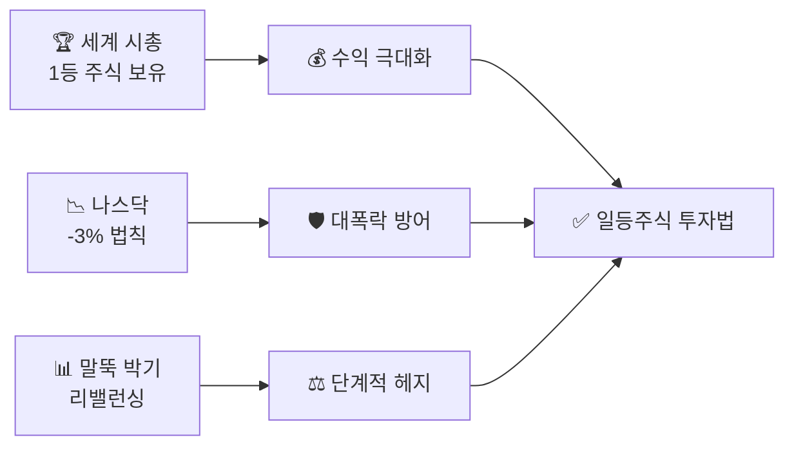

## 📊 조던(김장섭)의 일등주식 투자법

복잡한 경제 지표 대신 **세계 1등 기업 시가총액**과 **나스닥 지수**라는
두 가지 명확한 기준만으로 리스크를 관리하고 수익을 극대화하는 전략입니다.

::: key
**💡 핵심 철학** — "세상의 돈은 결국 가장 힘이 센 1등에게 몰린다."
수익을 내는 것보다 **잃지 않는 것이 먼저**입니다.
:::

### 전략의 3가지 축

### 시나리오별 행동 지침

| 상황 | 행동 지침 | 이유 |
|------|---------|------|
| **평상시** | 세계 시총 1등 100% 보유 | 1등은 장기 우상향 |
| **나스닥 -3% 발생** | 비중 축소 또는 전량 매도 | 대폭락 전조 신호 |
| **한 달간 -3% 없음** | 1등 주식 재매수 | 시장 안정 판단 |
| **2등이 10% 내로 추격** | 1등 50% : 2등 50% 분산 | 순위 교체 과도기 |
| **전고점 대비 -2.5% 하락** | 주식 10% 현금화 | 하락 리스크 헤지 |

### 전략 5단계 요약

::: steps
1. **종목 선택** — 전 세계 시총 1등 주식만 보유합니다. 분석 불필요, 기준이 명확합니다.
2. **하락 신호 감지** — 나스닥이 하루 -3% 이상 떨어지면 즉시 비중을 줄입니다.
3. **현금 대기** — 마지막 -3% 이후 30일간 조용하면 다시 매수합니다.
4. **단계적 헤지** — 전고점 대비 -2.5%마다 10%씩 현금화해 하락을 방어합니다.
5. **1등 교체** — 시총 순위가 바뀌면 새 1등으로 전량 갈아탑니다.
:::

  

    <h4>✅ 이 전략의 장점</h4>
    <ul>
      <li>감정 배제 — 기계적 원칙 매매</li>
      <li>초보자도 실행 가능한 명확한 기준</li>
      <li>대형 하락장에서 자산 보호</li>
      <li>종목 분석 없이 1등만 추적</li>
    </ul>
  

  

    <h4>⚠️ 주의할 점</h4>
    <ul>
      <li>잦은 매매 시 양도소득세·수수료 발생</li>
      <li>-3% 발생 시 즉시 실행하는 규율 필요</li>
      <li>단기 반등 후 재하락 시 손실 가능</li>
      <li>원칙을 어기는 순간 전략이 무너짐</li>
    </ul>
  

::: info
**📈 진입·매수법 바로 가기**
언제 처음 살지, 얼마나 살지, 어떻게 나눠 살지 — 실전 시나리오 3가지와 함께 정리했습니다.

→ 상단 **[진입·매수법]** 탭에서 확인하세요.
:::

::: key
**💡 핵심 결론** — "내가 시장보다 똑똑할 수 없다"는 것을 인정하고,
철저히 **데이터(시가총액, 지수 하락률)에 기반해 움직이는** 규칙 기반 투자법입니다.
:::
