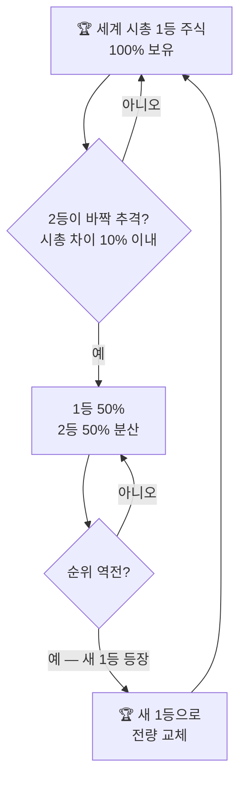

## 🏆 투자 대상 — 무조건 세계 시총 1등

주식 시장에서 가장 안전하고 강력한 주식은 **전 세계 시가총액 1위 기업**입니다.
현재 기준으로는 엔비디아, 애플, 마이크로소프트 등이 해당됩니다.

::: key
**💡 핵심 논리** — 세상의 돈은 결국 가장 힘이 센 1등에게 몰립니다.
1등 기업은 위기에서도 가장 잘 버티고, 호황에는 시장을 선도합니다.
:::

  

    <h4>✅ 1등 기업의 강점</h4>
    <ul>
      <li>위기 상황에서도 가장 잘 버팀</li>
      <li>호황기에는 시장을 선도</li>
      <li>전 세계 자금이 집중되는 구조</li>
      <li>초보자도 종목 선택 고민 불필요</li>
    </ul>
  

  

    <h4>🔄 종목 교체 기준</h4>
    <ul>
      <li>2등이 1등과 시총 차이 <strong>10% 이내</strong>로 좁혀지면</li>
      <li>1등 50% : 2등 50% 분산 보유</li>
      <li>순위가 완전히 뒤바뀌면</li>
      <li>전량 새 1등으로 갈아탐</li>
    </ul>
  

### 1등 주식 보유 및 교체 흐름

::: analogy 🧒 반장 선거 비유
반에서 1등(반장)이 가장 인기 많고 힘이 셉니다.
2등이 무섭게 치고 올라오면 둘 다 친하게 지내다가,
결국 새 반장이 뽑히면 새 반장 편을 드는 것입니다.
:::

### 시총 1등 변화 역사 (참고)

| 시기 | 세계 시총 1등 |
|------|------------|
| 2012~2018년 | 애플 (Apple) |
| 2018~2023년 | 애플 ↔ 마이크로소프트 교차 |
| 2024년 초 | 마이크로소프트 |
| 2024년 말~ | **엔비디아 (NVIDIA)** |

::: info
**📌 현재 (2026년 4월)** — 엔비디아가 시총 약 4.8조 달러로 1위 독주 중.
알파벳(구글)과 애플이 2~3위 추격. 아직 10% 이내 격차 아님 → 엔비디아 단독 보유 구간.
:::
