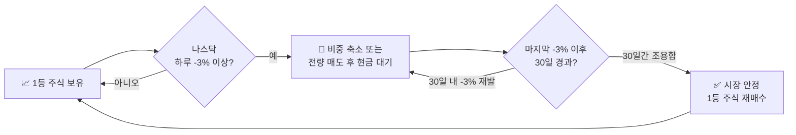

## 📉 매도 타이밍 — 나스닥 -3% 법칙

이 투자법의 핵심 안전장치입니다. 시장 대폭락을 피하기 위한 **자동 비상구**입니다.

::: warning
**📉 나스닥 하루 -3% 이상 하락 시** → 보유 주식 비중 즉시 축소 또는 전량 매도 후 달러(현금) 대기
:::

### '말일 한 달' 규칙 흐름

::: analogy 🧒 태풍 대피 비유
일기 예보에서 태풍 경보(나스닥 -3%)가 뜨면 즉시 대피소(현금)로 피합니다.
한 달 동안 태풍이 없으면 다시 집(주식)으로 돌아옵니다.
태풍이 지나가는 동안 집이 무너져도 나는 안전합니다.
:::

### '말일 한 달' 규칙 정리

| 상황 | 행동 |
|------|------|
| 나스닥 -3% 발생 | 즉시 비중 축소 (또는 전량 매도) |
| 이후 30일 내 -3% 재발 | 카운트 리셋, 계속 현금 대기 |
| 마지막 -3%로부터 30일 경과 | 1등 주식 재매수 |

### 왜 -3%인가?

::: info
나스닥이 하루 -3% 이상 하락하는 것은 단순 조정이 아닌 **공황 또는 대형 위기의 전조**로 해석합니다.
역사적으로 -3% 이상 하락이 반복될 때 대부분의 대폭락이 시작되었습니다.
반대로 -3% 한 번 뜨고 멈춘 경우는 대부분 단순 조정이었습니다.
:::

### 실제 -3% 활용 사례

| 시기 | 이벤트 | -3% 발생 횟수 | 결과 |
|------|--------|------------|------|
| 2020년 3월 | 코로나 폭락 | 연속 다수 | 매도 후 대피 → 반등 시 재매수로 수익 |
| 2022년 | 금리 인상 하락장 | 수차례 반복 | 현금 대피로 손실 방어 |
| 2024년 8월 | 엔 캐리 트레이드 청산 | 1회 후 회복 | 분할 대응으로 손실 최소화 |

::: key
**💡 핵심** — -3%는 '팔아라'는 신호가 아니라 **'조심하라'는 신호**입니다.
한 번이면 분할 대응, 여러 번 반복되면 공황 → 전량 현금화.
:::
