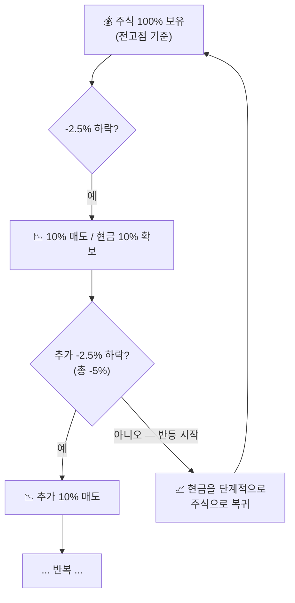

## ⚖️ 리밸런싱 — 말뚝 박기

주가 하락 시 기계적으로 대응해 자산이 녹아내리는 것을 방지하는 **헤지(Hedge) 전략**입니다.

::: key
**💡 핵심 논리** — "어디가 바닥인지 알 수 없다."
한꺼번에 다 팔거나 다 사는 대신, 주가 움직임에 맞춰 **단계적으로 비중을 조절**합니다.
:::

### 말뚝 박기 규칙

전고점 대비 하락폭에 따라 주식 비중을 기계적으로 줄입니다.

::: formula 말뚝 박기 공식
전고점 대비 **-2.5% 하락할 때마다** → 전체 주식의 **10%를 현금화**
:::

### 하락 구간별 비중 예시 (QQQ 기준)

| 하락률 (전고점 대비) | 주식 비중 | 현금 비중 | 대응 |
|-------------------|---------|---------|------|
| **0% ~ -2.5%** | 100% | 0% | 홀딩 (관망) |
| **-2.5% ~ -5.0%** | 90% | 10% | 1단계 말뚝 |
| **-5.0% ~ -7.5%** | 80% | 20% | 2단계 말뚝 |
| **-7.5% ~ -10.0%** | 70% | 30% | 3단계 말뚝 |
| **-10% 이상** | ... | ... | -3% 법칙과 병행 |

::: analogy 🧒 모래주머니 비유
홍수(하락장)가 오면 모래주머니(현금)를 하나씩 쌓습니다.
물이 빠지기 시작하면(반등) 모래주머니를 하나씩 치웁니다.
한꺼번에 다 쌓거나 다 치우는 게 아니라 **단계적으로** 대응하는 것이 핵심입니다.
:::

### 반등 시 대응 (V자 반등 대처)

하락 시 팔았던 주식을 다시 살 때는 더 신중해야 합니다.
- 확실한 지지선 확인 후 분할 매수
- 또는 전고점을 돌파하거나 -3% 이후 30일이 지난 후 재매수

::: info
**📌 주의** — 말뚝 박기는 -3%가 뜨지 않는 **완만한 하락장**에서 자산을 보호하는 도구입니다.
만약 하루에 -3%가 터진다면, 말뚝 박기보다 **-3% 법칙**이 우선 적용됩니다.
:::
