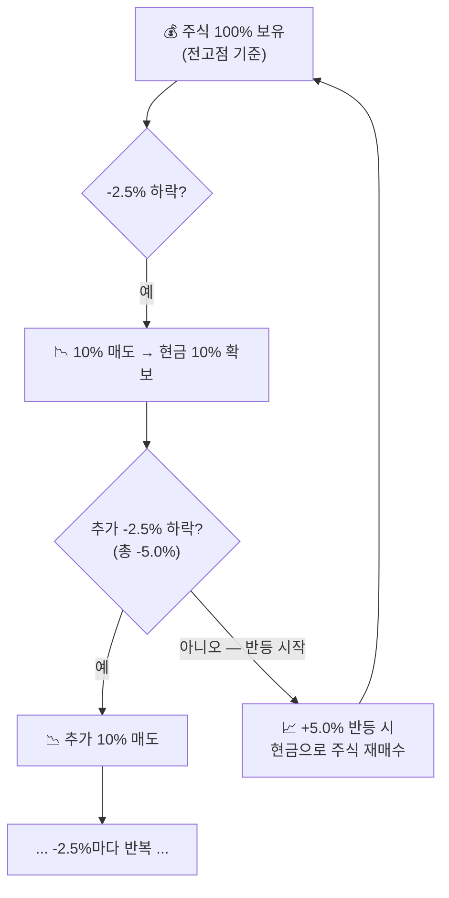
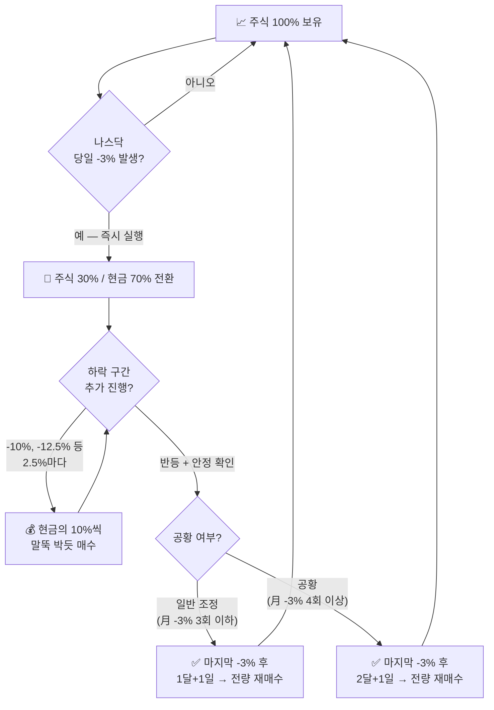

## ⚖️ 리밸런싱 & 말뚝박기

하락장에서 손실을 최소화하고, 반등 시 주식 수를 극대화하는 **두 가지 핵심 대응 전략**입니다.

::: key
**💡 대전제** — "세계 1등 주식은 결국 우상향한다."
어디가 바닥인지 알 수 없으므로, 감정 없이 **기계적 원칙**으로만 움직입니다.
:::

---

### 두 전략 한눈에 비교

| 구분 | 리밸런싱 | 말뚝박기 |
|------|----------|----------|
| **발동 조건** | 전고점 대비 **-2.5%** 하락마다 | 나스닥 당일 **-3%** 발생 시 |
| **핵심 동작** | 보유 주식의 **10% 매도** | 즉시 **주식 30% / 현금 70%** 전환 |
| **이후 대응** | -2.5% 마다 10%씩 추가 매도 | 하락 구간마다 10%씩 분할 재매수 |
| **재매수 조건** | **+2구간(+5.0%) 반등** 시 | 1달+1일 or 2달+1일 내 -3% 미발생 |
| **목적** | 완만한 하락에서 현금 확보 | 폭락장 자산 보호 + 저점 매수 |

---

### A. 리밸런싱 전략 — 완만한 하락 대응

나스닥 -3%가 없는 **완만한 하락 구간**에서, 전고점 대비 일정 비율 하락할 때마다 기계적으로 현금을 확보합니다.

::: formula 리밸런싱 공식
전고점 대비 **-2.5% 하락할 때마다** → 전체 주식의 **10%를 현금화**
:::



#### 하락 구간별 비중표 (리밸런싱)

| 단계 | 전고점 대비 하락폭 | 주식 비중 | 현금 비중 | 행동 |
|:----:|:---:|:---:|:---:|------|
| 기준 | **0%** (신고가) | 100% | 0% | 전량 보유 |
| 1구간 | **-2.5%** | 90% | 10% | 10% 매도 |
| 2구간 | **-5.0%** | 80% | 20% | 추가 10% 매도 |
| 3구간 | **-7.5%** | 70% | 30% | 추가 10% 매도 |
| 4구간 | **-10.0%** | 60% | 40% | 추가 10% 매도 |
| 5구간 | **-12.5%** | 50% | 50% | 추가 10% 매도 |

::: info
**📌 이득 원리** — 2구간(-5.0%)만 하락해도 이론적으로 이익입니다.
팔았던 가격(-2.5%)보다 더 내려간 가격(-5.0%)에서 더 많은 주식 수를 재매수할 수 있기 때문입니다.

**실제 예시 (애플 고점 $156.69 기준)**
- -2.5% 지점 → **$152.77** 에서 10% 매도
- -5.0% 지점 → **$148.86** 에서 10% 추가 매도
- 반등 +5.0% 시 → 더 많은 주식 수로 복귀
:::

---

### B. 말뚝박기 전략 — 나스닥 -3% 폭락 대응

나스닥 지수가 하루에 **-3% 이상** 폭락하면 공황의 전조로 보고, 즉시 강력한 현금화에 들어간 뒤 구간별로 다시 주식을 삽니다.



#### 말뚝박기 즉시 대응표

| 타이밍 | 주식 비중 | 현금 비중 | 행동 |
|--------|:---:|:---:|------|
| **나스닥 -3% 발생 직후** | **30%** | **70%** | 즉시 70% 현금화 |

#### 이후 하락 구간별 분할 매수 (말뚝 박기)

| 나스닥 추가 하락 구간 | 현금 투입 | 행동 |
|:---:|:---:|------|
| **-10.0%** | 보유 현금의 10% | 1차 말뚝 |
| **-12.5%** | 보유 현금의 10% | 2차 말뚝 |
| **-15.0%** | 보유 현금의 10% | 3차 말뚝 |
| 계속 반복 | -2.5%마다 10%씩 | 저점 분할 매수 |

#### 전량 재매수 조건

| 상황 | 공황 판단 기준 | 재매수 조건 |
|------|:---:|------|
| **일반 조정** | 月 -3% 3회 이하 | 마지막 -3% 후 **1달 + 1일** 동안 추가 -3% 없으면 전량 투입 |
| **공황** | 月 -3% **4회 이상** | 마지막 -3% 후 **2달 + 1일** 동안 추가 -3% 없으면 전량 투입 |

::: analogy 🧒 낚시 비유
파도가 너무 거세면(나스닥 -3%) 일단 뭍으로 올라옵니다(70% 현금화).
파도가 잔잔해질 때마다 조금씩 다시 물속에 낚싯대를 드리웁니다(말뚝 박기).
한 달 이상 파도가 잠잠하면 다시 완전히 바다로 나갑니다(전량 재매수).
:::

---

### C. 현재 신고가 상황에서의 대응 지침

엔비디아·구글처럼 1등 주식이 신고가를 경신하는 상승 구간에서의 행동 기준입니다.

| 상황 | 대응 전략 | 주식 비중 | 현금 비중 |
|------|----------|:---:|:---:|
| **신고가 경신 중** | 전량 보유 (Buy & Hold) | **100%** | 0% |
| 전고점 대비 **-2.5%** 하락 | 리밸런싱 1구간 시작 | 90% | 10% |
| 전고점 대비 **-5.0%** 하락 | 리밸런싱 2구간 | 80% | 20% |
| **나스닥 당일 -3%** 발생 | 말뚝박기 즉시 발동 | **30%** | **70%** |

::: key
**💡 지금 당장 체크해야 할 두 가지**

```
① 전고점 대비 -2.5% 도달?  →  리밸런싱 10% 매도 시작
② 오늘 나스닥 -3% 발생?    →  즉시 30%만 남기고 70% 현금화
```

신고가가 이어지는 동안은 100% 보유가 맞습니다.
단, 위 두 신호 중 하나라도 켜지면 **감정 없이 즉시 실행**합니다.
:::

::: warning
**⚠️ 우선순위** — 리밸런싱 진행 중 나스닥 -3%가 뜨면?
리밸런싱을 중단하고 **말뚝박기(-3% 법칙)가 즉시 우선 적용**됩니다.
말뚝박기가 더 강력한 대응이기 때문입니다.
:::

> 출처: [JD부자연구소 유튜브 — 리밸런싱+말뚝박기 설명](https://youtu.be/CNO29yQIRwA?si=Lj5WTBOAk6V5Qp_V)
