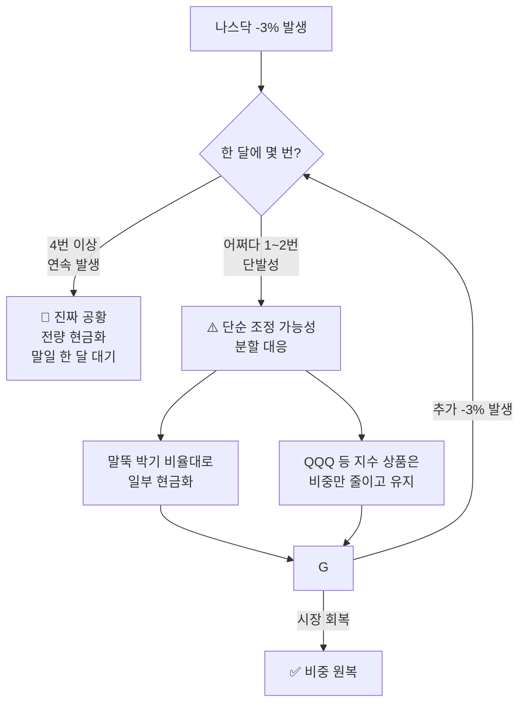

## 🔄 업데이트 전략 — 분할 대응

최근 조던(김장섭) 소장의 매뉴얼은 과거의 "무조건 전량 매도"에서
**"상황별 비중 조절 및 분할 대응"** 방식으로 진화했습니다.

::: key
**💡 진화의 핵심** — 나스닥 -3%를 '무조건 탈출'이 아닌 **'리스크 관리 시작'**으로 해석합니다.
단순 조정에 털리지 않으면서, 진짜 공황은 확실히 피하는 것이 목표입니다.
:::

### 공황 vs 단순 조정 구분

-3%가 한 달에 몇 번 발생하는지에 따라 대응 강도를 달리합니다.

| 상황 | 구분 | 대응 지침 |
|------|------|---------|
| **-3% 1~2회 발생** | 단순 조정 가능성 | **분할 대응** (비중 축소, 말뚝 박기) |
| **-3% 4회 이상 발생** | **진짜 공황(Panic)** | **전량 현금화** (예외 없음) |

### 분할 대응 흐름도

### 종목별 차등 대응 전략

자산의 성격에 따라 매도 강도를 조절합니다.

1. **개별 1등주 (엔비디아, 애플 등)**
   - -3% 1회 발생 시에도 비교적 엄격하게 비중 축소.
   - 변동성이 지수보다 크기 때문입니다.

2. **지수 ETF (QQQ, S&P500)**
   - -3% 1회에는 '말뚝 박기' 비율 정도로만 대응.
   - 장기 우상향 믿음이 강한 종목이므로 섣부른 전량 매도 지양.

3. **레버리지 ETF (QLD, TQQQ)**
   - -3% 1회 발생 시 **최소 50% 이상 즉시 현금화**.
   - 하락 시 자산 녹아내리는 속도가 치명적이기 때문입니다.

::: analogy 🧒 소나기 비유
- **과거 (전량 매도)**: 구름만 봐도 무조건 집 안으로 뛰어 들어갔습니다.
- **현재 (분할 대응)**: 구름이 끼면(1회) 우산을 꺼내 들고, 비가 쏟아지면(4회) 그때 집 안으로 들어갑니다.
준비는 하되, 아직 집 안에서 발이 묶이지는 않는 것입니다.
:::

::: warning
**⚠️ 절대 잊지 말 것** — "분할 대응"이 "공황에도 버티기"를 의미하는 것은 아닙니다.
한 달에 -3%가 4번 뜨는 진짜 공황에서는 **반드시 모든 주식을 팔고 현금화**해야 합니다.
:::
