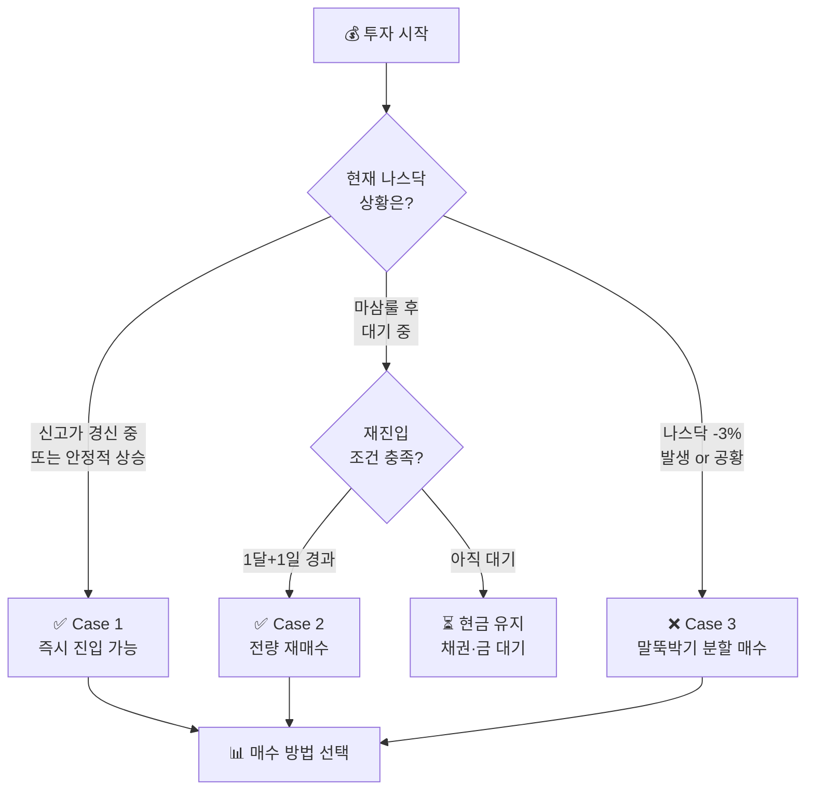
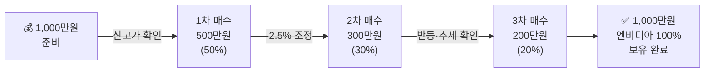
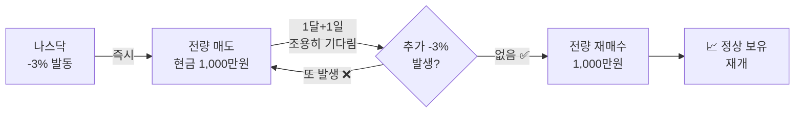

## 📈 진입 시점 & 매수 방법

기존 탭에 흩어진 **"언제·얼마나·어떻게 살 것인가"** 를 한 곳에 모았습니다.

::: key
**💡 3가지 핵심 질문**
1. **언제** 진입하나? → 신호 확인
2. **얼마나** 사나? → 상황별 비중
3. **어떻게** 사나? → 일시 vs 분할
:::

---

### 한눈에 요약

| 질문 | 답 |
|------|------|
| 무엇을 살까? | 세계 시총 **1등 주식** (현재 엔비디아) |
| 언제 처음 살까? | **신고가 경신 중**이면 지금 바로 |
| 얼마나 살까? | 신고가 경신 중 → **100%**, 불확실 → **분할** |
| 어떻게 살까? | 신규 → 분할 매수, 재진입 → 조건 확인 후 전량 |
| 언제 대기할까? | 나스닥 **-3% 발생 당일** 및 공황 진행 중 |

---

### A. 첫 진입 시점

#### 진입해도 좋은 신호 ✅

| 신호 | 설명 | 권장 비중 |
|------|------|:---:|
| **신고가 경신 중** | 역대 최고가 갱신 진행 | 50~100% |
| **나스닥 8거래일 연속 상승** | 상승 추세 재확인 | 50~100% |
| **마삼룰 재진입 조건 충족** | 1달+1일 / 2달+1일 경과 | 100% |

::: info
**📌 왜 신고가에 사도 될까?**
신고가는 "비싸다"는 신호가 아니라 **"시장 전체가 이 기업을 계속 인정한다"** 는 증거입니다.
1등 주식은 신고가를 갱신하며 계속 우상향하는 것이 역사적 패턴입니다.
:::

#### 진입 금지 신호 ❌

| 신호 | 이유 | 대안 |
|------|------|------|
| **나스닥 -3% 당일** | 말뚝박기 모드 즉시 전환 | 현금 70% 대기 |
| **공황 진행 중** (월 -3% 4회↑) | 추가 하락 가능성 | 구간별 분할 매수 |

---

### B. 매수 시점 — 3가지 케이스

#### Case 1 — 신규 투자자 첫 진입 (신고가 경신 중)

**상황**: 엔비디아가 신고가를 경신하며 상승 중, 처음 투자 시작

| 방법 | 내용 | 적합한 유형 |
|------|------|------|
| **일시 매수** | 전액 한 번에 매수 | 확신이 있을 때 |
| **분할 매수** | 50% → 30% → 20% 순으로 | 처음이라 불안할 때 |

::: analogy 🧒 버스 탑승 비유
버스(1등 주식)가 이미 출발해서 달리고 있어도, **목적지가 더 멀다면 지금 타는 게 맞습니다.**
"이미 올랐으니 다음 버스를 기다릴게요"는 가장 위험한 생각입니다.
:::

#### Case 2 — 마삼룰 발동 후 재진입

**상황**: 나스닥 -3% 발동으로 전량 매도 후 현금·채권 대기 중

| 조건 | 재진입 신호 | 매수 방법 |
|------|------|------|
| **일반 조정** | 마지막 -3% 후 **1달 + 1일** 추가 -3% 없음 | 전량 일시 재매수 |
| **공황** (월 4회↑) | 마지막 -3% 후 **2달 + 1일** 추가 -3% 없음 | 전량 일시 재매수 |
| **개선룰** | 나스닥 **8거래일 연속 상승** 확인 | 전량 일시 재매수 |

#### Case 3 — 나스닥 -3% 발생 / 공황 중 분할 매수

**상황**: 나스닥 -3% 발생, 즉시 30% 보유 / 70% 현금 전환 후

| 추가 하락 구간 | 투입 비율 | 목적 |
|:---:|:---:|------|
| -3% 발생 직후 | **현금 70% 확보** | 자산 보호 |
| 추가 -5% | 현금의 10% | 1차 말뚝 |
| 추가 -10% | 현금의 10% | 2차 말뚝 |
| 추가 -15% | 현금의 10% | 3차 말뚝 |
| 반등 안정 확인 | 잔여 현금 전량 | 복귀 완료 |

---

### C. 매수 방법 — 일시 vs 분할

| 구분 | 일시 매수 | 분할 매수 |
|------|------|------|
| **언제** | 신고가 경신 확실할 때 | 처음이거나 불확실할 때 |
| **방법** | 전액 한 번에 | 2~3회 나눠서 |
| **장점** | 상승분 전부 수익 | 심리적 안정, 리스크 분산 |
| **단점** | 심리적 부담 | 일부 수익 놓칠 수 있음 |

::: formula 분할 매수 황금 비율
1차 매수: 전체의 **50%** (진입 결정 시점)
2차 매수: 전체의 **30%** (-2.5~5% 조정 시 또는 상승 추세 확인 시)
3차 매수: 전체의 **20%** (추세 완전 확인 후)
:::

---

### D. 실전 시나리오 3가지

#### 시나리오 1 — 처음 시작하는 투자자 (1,000만원)

**현재 상황**: 엔비디아 신고가 경신 중

| 단계 | 주가 | 투입금 | 누적 투자 | 포인트 |
|:---:|:---:|---:|:---:|------|
| 1차 | 신고가 100,000원 | 500만원 | 50만원 | 신고가 = 진입 신호 |
| 2차 | -2.5% → 97,500원 | 300만원 | 80만원 | 조정이 곧 기회 |
| 3차 | 반등 확인 | 200만원 | 100만원 | 추세 재확인 후 완료 |

---

#### 시나리오 2 — 마삼룰 발동 후 재진입 (1,000만원)

**현재 상황**: 나스닥 -3% 발동 → 전량 매도 → 1달+1일 경과 → 추가 -3% 없음

| 단계 | 행동 | 자산 상태 |
|------|------|------|
| -3% 발생 당일 | 전량 매도 | 현금 1,000만원 |
| 대기 기간 | 채권(TLT) 또는 금(IAU) 운용 | 현금 손실 최소화 |
| 1달+1일 후 | 전량 재매수 | 엔비디아 100% 복귀 |

---

#### 시나리오 3 — 공황 중 말뚝박기 분할 매수 (1,000만원)

**현재 상황**: 나스닥 -3% 발동, 공황 진행 중

| 단계 | 나스닥 | 주가 | 행동 | 보유 주식 | 현금 | 평가액 |
|:---:|:---:|:---:|------|:---:|---:|---:|
| ① | -3% 발생 | 97,000원 | 70주 즉시 매도 | 30주 | 679만원 | 970만원 |
| ② | 추가 -5% | 95,000원 | 현금 10% → 7주 매수 | 37주 | 612만원 | 964만원 |
| ③ | 추가 -10% | 90,000원 | 현금 10% → 6주 매수 | 43주 | 558만원 | 946만원 |
| ④ | 2달+1일 경과 | 92,000원 | 잔여 현금 전량 재매수 | 103주 | 0원 | 948만원 |
| ⑤ | 신고가 회복 | 100,000원 | 보유 유지 | 103주 | 0원 | **1,030만원** |

::: key
**💡 핵심 결론** — 주가가 원점으로 돌아왔을 때
- 그냥 홀딩: 100주 × 100,000원 = **1,000만원** (본전)
- 말뚝박기: 103주 × 100,000원 = **1,030만원** (+3%)

**하락장을 기계적으로 대응하면, 회복 후 더 많은 주식 수를 보유하게 됩니다.**
:::

> 출처: [JD부자연구소 유튜브 — 리밸런싱+말뚝박기 설명](https://youtu.be/CNO29yQIRwA?si=Lj5WTBOAk6V5Qp_V)
