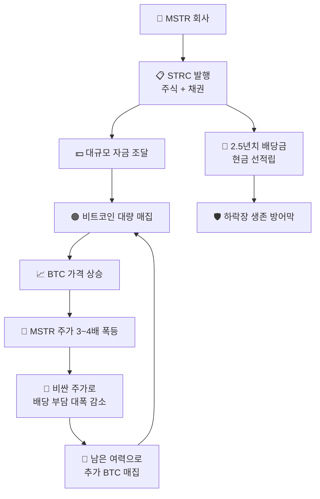

## 📌 MSTR 전략 개요

마이크로스트래티지(MicroStrategy)는 마이클 세일러(Michael Saylor) CEO가 이끄는 기업으로,
**세계에서 가장 많은 비트코인을 보유한 상장 기업**입니다.
단순히 비트코인을 사는 것이 아니라 레버리지로 비트코인 보유량을 극대화하는 정교한 금융 전략을 씁니다.

::: analogy 🧒 어린이 비유 — 황금알 거위 사기
철수(MSTR)가 친구들에게 *"나중에 맛있는 거 사줄게"* 라고 약속하고 용돈을 모은 뒤(STRC 발행),
그 돈으로 황금알을 낳는 거위(비트코인)를 한꺼번에 많이 삽니다.
거위가 낳는 알의 가치가 갚아야 할 약속보다 훨씬 클 것이라고 믿기 때문이죠!
:::

### 3대 핵심 전략

::: steps
1. **🏗️ STRC 발행 — 레버리지 자금 조달**
   주식(ATM 발행)과 채권(전환사채)을 팔아 대규모 자금을 확보, 비트코인을 대량 매집합니다.
2. **🟠 비트코인 매집 — BTC Yield 극대화**
   조달 자금으로 즉시 비트코인을 구매. 목표는 '주당 비트코인 개수(BTC per Share)'를 지속적으로 늘리는 것입니다.
3. **💰 2.5년치 배당 선적립 — 안전망 구축**
   STRC 보유자에게 줄 배당금(11.5%)을 2.5년치 미리 준비. 비트코인이 하락해도 파산하지 않는 방어막입니다.
:::

### MSTR 전략 전체 구조

::: key
**💡 핵심** — MSTR은 비트코인을 단순 보관하는 회사가 아닙니다.
**비트코인 상승을 레버리지로 증폭시켜 주주 가치를 극대화**하는 금융 엔진입니다.
:::
