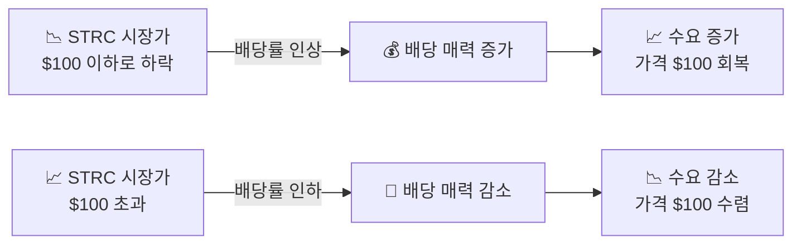
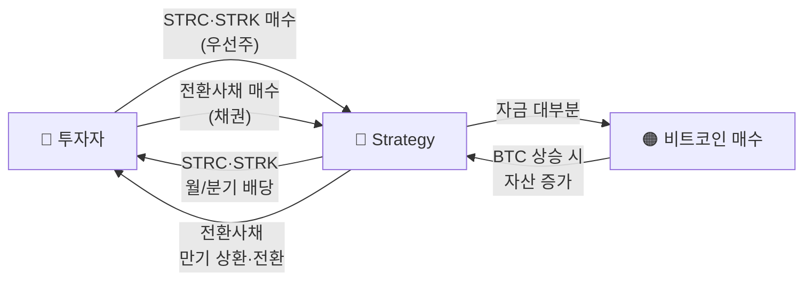
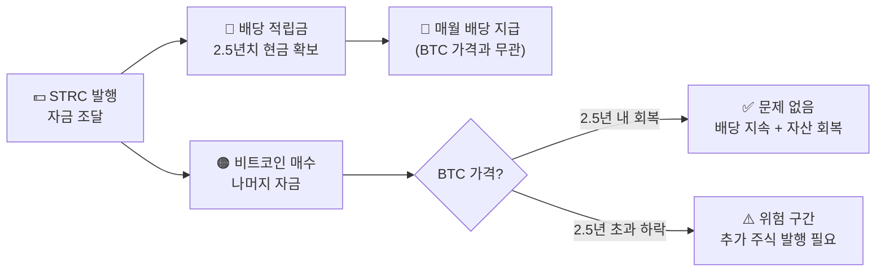
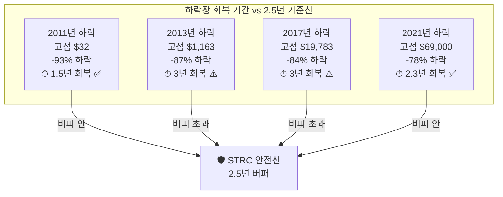
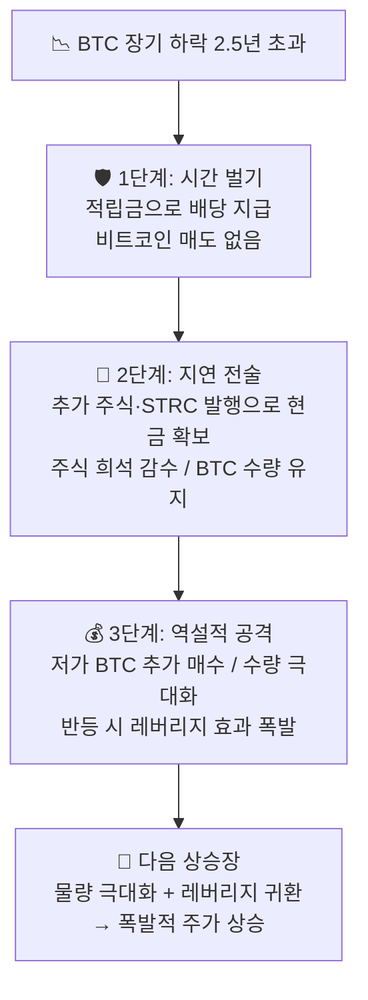

## 💰 STRC — 우선주 발행 원리

**STRC**는 Strategy(구 MicroStrategy)가 발행한 **나스닥 상장 우선주**입니다.
정식 명칭은 *Variable Rate Series A Perpetual "Stretch" Preferred Stock* (티커: STRC).
비트코인 매집 자금을 마련하기 위해 2025년 7월 발행되었습니다.

::: info
**📌 STRC는 채권이 아닌 우선주(Preferred Stock)** — 이자가 아닌 **배당**을 지급하며, 회계상 부채(Debt)가 아닌 자본(Equity) 항목입니다. 나스닥에서 주식처럼 사고팔 수 있고, FDIC 보험 대상이 아니며 배당은 보장되지 않습니다.
:::

<!-- 2열 카드 -->

  

    <h4>📋 핵심 구조</h4>
    <ul>
      <li>액면가: <strong>$100/주</strong></li>
      <li>IPO 발행가: 약 $90 (2025년 7월)</li>
      <li>배당: 월 지급, 변동금리</li>
      <li>만기: 없음 (영구 Perpetual)</li>
      <li>임의 상환가: $101 + 미지급 배당</li>
    </ul>
  

  

    <h4>📊 권리 우선순위</h4>
    <ul>
      <li>일반 채권보다 후순위</li>
      <li>보통주(MSTR)보다 선순위</li>
      <li>배당 누적형 (누락 시 이월)</li>
      <li>배당 정지 조항 포함</li>
      <li>주요 변경 시 홀더 풋(Put) $100</li>
    </ul>
  

### 핵심: 변동금리 → 가격 안정화 메커니즘

STRC의 가장 독특한 특징은 **이사회가 매월 배당률을 조정**한다는 점입니다.
목표는 하나 — 시장 가격을 **$100 근처**로 유지하는 것.

::: analogy 🧒 온도 조절기 비유
에어컨처럼 방이 너무 더우면(가격 상승) 냉방을 줄이고,
너무 차가우면(가격 하락) 냉방을 강화합니다.
STRC는 배당률로 가격을 $100에 '자동 맞춤' 합니다.
:::

### 배당률 변화 이력

| 시점 | 연 배당률 | 비고 |
|------|---------|------|
| 2025년 7월 (발행) | **9.00%** | IPO 초기 설정 |
| 2026년 4월 (현재) | **~11.50%** | 시장 여건 반영 인상 |

::: formula STRC 연 배당 예시 ($100 액면 기준)
연 배당 ≈ $100 × 11.50% = $11.50/년
월 배당 ≈ $0.96/주 (매월 현금 지급)
:::

---

### 🏗️ Strategy의 하이브리드 자금 조달 구조

STRC는 Strategy가 활용하는 여러 조달 수단 중 하나입니다.
회사는 **우선주 + 전환사채**를 함께 활용해 비트코인 매집 자금을 다각화합니다.

| 수단 | 종류 | 특징 |
|------|------|------|
| **STRC** | 변동금리 우선주 | 월 배당, $100 가격 안정 목표 |
| **STRK** | 전환 우선주 | 고정 배당, MSTR 주식 전환 옵션 |
| **전환사채** | 채권 (부채) | 0%~저금리, 대규모 조달 가능 |
| **STRD** | 디지털 채권 | 신규 도입, 조달 창구 다양화 |

::: key
**💡 핵심** — STRC(우선주)와 전환사채(채권)는 역할이 다릅니다.
STRC는 안정적 월 현금 흐름을 원하는 투자자를 위한 자본 조달,
전환사채는 대규모 비트코인 매집을 위한 부채 레버리지입니다.
두 수단을 함께 사용해 Strategy는 조달 창구를 다양화합니다.
:::

### 지속 가능성 — 세일러의 기준

::: formula 마이클 세일러 발언 (2026년 기준)
BTC 연간 상승률 ≥ 2.05%
→ 추가 주식 발행 없이 STRC 배당(~11.5%) 영구 지급 가능
BTC 장기 평균 상승률(역사적) ≈ 40~60% → 충분한 여유
:::

---

### 🛡️ 2.5년 배당 선적립 — 안전 버퍼

STRC 발행 시 Strategy는 **향후 2.5년치 배당금을 현금으로 미리 적립**합니다.
이 버퍼가 존재하는 한, BTC 가격이 폭락해도 배당은 계속 지급됩니다.

::: key
**💡 핵심** — BTC가 2.5년 안에만 회복되면 STRC 투자자는 배당을 꼬박꼬박 받으면서 손실 없이 버틸 수 있습니다. 2.5년이라는 시간이 핵심 안전망입니다.
:::

---

### 📉 과거 비트코인 하락장 — 얼마나 오래 떨어졌나?

"비트코인이 2.5년 이상 회복 못 한 적 있는가?" — 과거 데이터로 확인합니다.

| 하락 시작 | 고점 | 저점 | 하락률 | 고점 회복까지 | 2.5년 초과? |
|---------|------|------|-------|------------|-----------|
| 2011년 6월 | $32 | $2 | **-93%** | ~1.5년 (2013년 2월) | ✅ 이내 회복 |
| 2013년 11월 | $1,163 | $152 | **-87%** | ~3년 (2016년 12월) | ⚠️ 초과 |
| 2017년 12월 | $19,783 | $3,122 | **-84%** | ~3년 (2020년 11월) | ⚠️ 초과 |
| 2021년 11월 | $69,000 | $15,500 | **-78%** | ~2.3년 (2024년 3월) | ✅ 이내 회복 |

### 역사적 데이터가 말하는 것

  

    <h4>✅ 2.5년 내 회복 (2건)</h4>
    <ul>
      <li>2011년 하락 → <strong>1.5년</strong> 만에 고점 회복</li>
      <li>2021년 하락 → <strong>2.3년</strong> 만에 고점 회복</li>
      <li>비트코인 채택률이 높아질수록 회복 속도가 빨라지는 추세</li>
    </ul>
  

  

    <h4>⚠️ 2.5년 초과 (2건)</h4>
    <ul>
      <li>2013년 하락 → <strong>3년</strong> 소요 (초기 시장, 유동성 낮음)</li>
      <li>2017년 하락 → <strong>3년</strong> 소요 (ICO 버블 붕괴)</li>
      <li>두 사례 모두 기관 참여 이전의 초기 시장에서 발생</li>
    </ul>
  

::: analogy 🧒 3년치 식량 비유
핵 대피소에 들어가면서 3년치 식량(배당 적립금)을 쌓아뒀습니다.
과거 4번의 겨울 중 2번은 2.5년 안에 봄이 왔고,
나머지 2번은 봄이 오는 데 3년이 걸렸습니다.
그리고 그 2번은 모두 비트코인이 지금보다 훨씬 작고 알려지지 않았던 시절이었습니다.
:::

---

### 🏰 2.5년 넘게 하락하면? — 3단계 방어막

비트코인이 2.5년 이상 계속 떨어지는 최악의 시나리오에서도
MSTR은 아래의 3단계로 대응합니다.

::: steps
1. **1단계 — 시간 벌기 (0~2.5년)**
   미리 쌓아둔 배당 적립금으로 버팁니다. 비트코인을 단 하나도 팔 필요 없이 약속한 배당금을 꼬박꼬박 지급합니다. 시장이 공포에 질려도 "우리는 2.5년은 끄떡없다"고 선언할 수 있습니다.

2. **2단계 — 지연 전술 (2.5년 이후)**
   추가 주식 또는 새 STRC를 발행해 현금을 마련합니다. 비트코인을 파는 대신 주식을 더 발행하는 것입니다. 주주 지분은 희석되지만 비트코인 보유량은 그대로입니다. 마이클 세일러의 철학은 **"비트코인은 절대 팔지 않는다(HODL)"**입니다.

3. **3단계 — 역설적 공격 (반등 준비)**
   하락장이 길어질수록 STRC로 조달한 자금으로 더 싼 가격의 비트코인을 더 많이 삽니다. 반등이 시작되면 하락기에 쌓은 물량이 레버리지 효과를 폭발적으로 증폭시킵니다.
:::

### 시나리오별 대응 요약

| 상황 | MSTR의 대응 | 결과 |
|------|-----------|------|
| **0~2.5년 하락** | 적립금으로 배당 지급 | BTC 매도 없음 — 안전 |
| **2.5년 이후도 하락** | 추가 주식·STRC 발행 | 주식 희석 — 고통스럽지만 생존 |
| **반등 시작** | 하락기에 쌓은 BTC로 폭발적 상승 | 레버리지 효과 귀환 |

::: key
**💡 핵심 결론** — MSTR 모델의 강점은 '파산 조건이 거의 없다'는 것입니다.
일반 레버리지는 담보 가치가 떨어지면 강제 청산이 발생하지만,
MSTR은 만기가 없거나 매우 긴 우선주·전환사채로 자금을 조달했기 때문에
비트코인이 아무리 하락해도 **"안 팔고 버틸 수 있는 권리"** 가 있습니다.
결국 주주 지분을 일부 희석하더라도 비트코인 물량을 끝까지 지켜내어
다음 상승장에서 승리하는 전략입니다.
:::

::: analogy 🧒 포위된 성 비유
적군(하락장)이 성을 포위했습니다.
1단계: 미리 쌓아둔 식량(적립금)으로 2.5년을 버팁니다.
2단계: 성 안의 땅(주식)을 조금씩 팔아 식량을 더 삽니다.
3단계: 적군이 지쳐 후퇴할 때(반등), 오히려 반격해 영토를 두 배로 늘립니다.
성벽(비트코인)은 끝까지 지킨 것이 승리의 핵심입니다.
:::

::: warning
**⚠️ 주의** — 과거 데이터가 미래를 보장하지 않습니다. STRC 배당은 이사회 결의에 따르며 보장되지 않습니다. FDIC 예금자 보호 대상이 아니며, BTC 급락이 장기화되면 배당 지급이 중단될 수 있습니다.
:::
