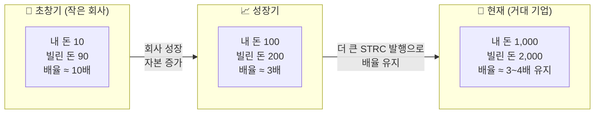

## 📈 레버리지(지렛대) 효과

레버리지란 **적은 내 돈에 많은 빌린 돈을 합쳐 큰 수익을 만드는 방법**입니다.

::: analogy 🚲 자전거 대여점 비유
철수가 자기 돈 100만원 + STRC로 빌린 900만원 = 총 1,000만원으로 비트코인 10개를 삽니다.
비트코인이 2배 오르면? 2,000만원 − 빚 900만원 = **1,100만원**.
내 돈 100만원이 1,100만원이 됐습니다(수익률 1,000%)!
:::

### 직접투자 vs 레버리지 투자 비교

| 구분 | 직접 BTC 투자 | MSTR 레버리지 투자 |
|------|-------------|-----------------|
| 초기 투자 | 내 돈 100만원 | 내 돈 100만원 + 빌린 돈 900만원 |
| 구매 BTC | 1개 | **10개** |
| 2배 상승 후 자산 | 200만원 | 2,000만원 |
| 빚 상환 | 없음 | −900만원 |
| **최종 수중 금액** | **200만원** | **1,100만원** |
| **수익률** | **+100%** | **+1,000% (10배)** |

### 레버리지 배율의 시간적 변화

::: info
**왜 초창기 10배 → 현재 3배로 줄었나?**
배율 = 빌린 돈 ÷ 내 돈. 회사가 성공해 내 자본이 커질수록 배율이 낮아집니다.
지금은 **더 거대한 STRC를 발행**해 3~4배 수준을 유지합니다.
:::

### BTC +3% → MSTR +12%는 왜?

::: steps
1. **채무 레버리지**
   빚은 고정, BTC는 오름 → 주주 몫이 더 가파르게 증가합니다.
2. **BTC 수량 증가**
   MSTR은 주식 발행으로 BTC를 계속 추가 매집해 주당 BTC 개수가 늘어납니다.
3. **프리미엄 확대**
   BTC 반등 시 더 큰 수익을 원하는 자금이 MSTR로 몰려 웃돈(프리미엄)이 붙습니다.
:::

::: formula MSTR 주가 상승률 =
BTC 상승률 × 레버리지 배율 × 프리미엄 변화
예) BTC +3% × 3배 × α → MSTR +12% (약 4배 증폭)
:::
