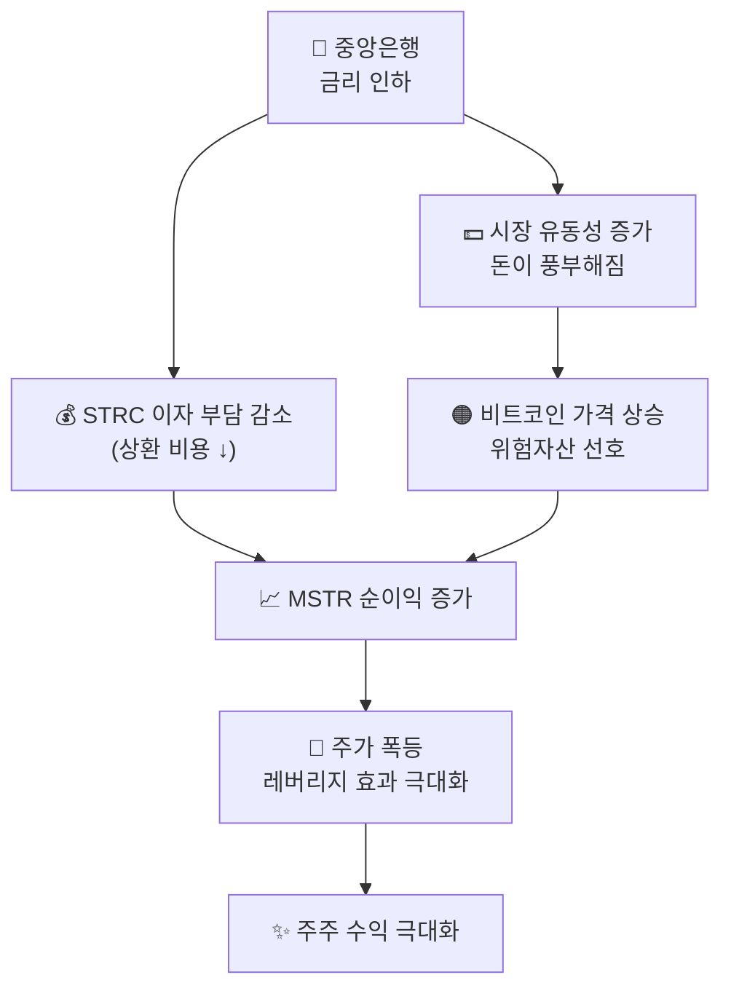

## 🏦 금리 인하와 레버리지 극대화

금리 인하는 MSTR에게 **이중의 선물**을 줍니다.
빌린 돈의 이자 부담은 줄고, 비트코인 가격은 오르기 때문입니다.

::: analogy 🧁 사탕 비유
철수가 친구들에게 *"나중에 사탕 10개 줄게"* 라고 빌렸는데,
마을에 사탕이 흔해져서 *"2개만 줘도 돼"* 로 바뀐 것이 금리 인하입니다.
빚 이자는 싸졌는데, 사둔 거위(비트코인) 값은 엄청 올랐습니다!
:::

### 금리 인하 → 레버리지 극대화 경로

### 금리별 MSTR 영향 비교

| 금리 환경 | 이자 부담 | 비트코인 가격 | MSTR 레버리지 |
|---------|---------|------------|------------|
| 🔻 **금리 인하** | 감소 ↓ | 상승 ↑ | **극대화 🚀** |
| ➡️ **금리 유지** | 변화 없음 | 중립 | 유지 |
| 🔺 **금리 인상** | 증가 ↑ | 하락 ↓ | **이중 압박 ⚠️** |

::: key
**💡 핵심** — 금리 인하 = **빚 비용 감소 + BTC 가격 상승의 더블 효과**.
두 가지가 동시에 일어나면 레버리지가 기하급수적으로 폭발합니다.
MSTR이 금리 인하 사이클에서 가장 강력한 이유입니다.
:::

::: analogy 🏋️ 지렛대 비유
금리 인하는 MSTR의 지렛대를 더 길게 만들어 주는 것과 같습니다.
같은 힘(비트코인 매집)으로도 훨씬 더 무거운 것(높은 주가)을 들어올릴 수 있게 됩니다.
:::
