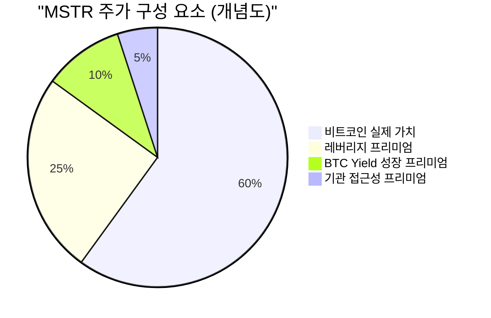

## ⭐ 프리미엄(웃돈)이 붙는 이유

MSTR 주가는 실제 보유 BTC 가치보다 **1.5~2배 더 비싸게** 거래됩니다.
왜 사람들은 비트코인을 직접 사지 않고 더 비싼 MSTR을 살까요?

::: analogy 🗺️ 금광 보물지도 비유
비트코인을 직접 사는 것은 금괴 1개를 사는 것.
MSTR 주식은 *"전문 금광 채굴팀(레버리지 전략)"* 을 고용하는 것입니다.
팀이 있으면 혼자 파는 것보다 훨씬 많은 금을 캘 수 있기 때문에,
팀 고용 비용(프리미엄)을 기꺼이 지불합니다.
:::

### 프리미엄 발생의 3가지 이유

::: steps
1. **🚀 성장성 — BTC Yield**
   직접 BTC를 들고 있으면 개수가 그대로지만, MSTR 주식은 시간이 갈수록 주당 BTC 개수가 자동으로 늘어납니다. "내 1주가 점점 더 많은 BTC를 품는다!" → 프리미엄 발생
2. **🏢 편의성 — 기관 접근성**
   연기금·기관투자자는 규정상 BTC를 직접 살 수 없습니다. MSTR은 이들에게 유일한 비트코인 투자 통로입니다. 강한 제도권 수요 → 프리미엄
3. **💰 레버리지 수익 기대**
   BTC 1% 오를 때 MSTR은 3~4% 오릅니다. 같은 투자금으로 3~4배 수익을 원하는 투자자들이 몰립니다. 수요 폭발 → 프리미엄
:::

### MSTR 주가 구성 요소

### 프리미엄이 주식 발행을 도와주는 역설

| 구분 | 프리미엄 없을 때 | 프리미엄 2배일 때 |
|-----|--------------|----------------|
| 주식 1주의 BTC 가치 | 100만원 | 100만원 |
| 실제 시장 주가 | 100만원 | **200만원** |
| 주식 1주 발행으로 얻는 현금 | 100만원 | **200만원** |
| 그 현금으로 살 수 있는 BTC | 1개 | **2개 (공짜 BTC 1개!)** |
| 기존 주주 입장 | 희석 발생 | **주당 BTC 오히려 증가!** |

::: key
**💡 프리미엄의 역설** — 프리미엄 상태에서 주식을 발행하면 지분이 희석되지만
**주당 BTC 개수는 오히려 늘어납니다**.
비싼 종이(주가)로 싼 물건(BTC)을 사오는 것과 같습니다!
:::
