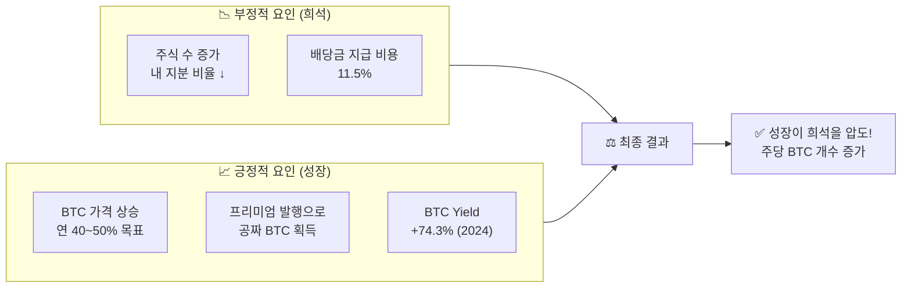

## 🔢 주식 희석 vs 비트코인 성장

가장 많이 받는 질문: **"주식을 계속 발행하면 내 지분이 희석되어 가치가 떨어지지 않나요?"**

::: analogy 🍕 피자 비유
피자를 4명이 나눠 먹다가 8명이 되면 내 몫이 줄어듭니다(희석).
하지만 MSTR은 사람(주식)을 늘릴 때마다 피자 판(비트코인)을 2배로 키웁니다.
식구는 늘었지만 내 피자 조각이 오히려 더 커지는 마법!
:::

<!-- 2열 비교 -->

  

    <h4>😰 희석의 우려 (일반 기업)</h4>
    
주식 수 10% 증가 → 내 지분 비율 10% 감소

    
새 주식을 팔아 받은 돈을 비생산적으로 씀

  

  

    <h4>✅ MSTR의 현실</h4>
    
주식 수 10% 증가 → BTC 보유량 20% 증가

    
<strong>BTC Yield 2024년: +74.3%</strong>

  

### BTC Yield — 마이클 세일러가 가장 중요하게 보는 지표

BTC Yield = "주식 수가 늘어난 것보다 비트코인 개수가 얼마나 더 빨리 늘어났나?"

::: formula BTC Yield (2024년 실제 기록)
+74.3%
주식 수 증가 속도보다 BTC 개수가 74% 더 빠르게 증가!
:::

### 희석 vs 성장의 줄다리기

### 비트코인 가격과 희석 부담의 관계

| BTC 가격 | MSTR 주가 | 배당 11.5%를 위한 주식 발행량 | 희석 영향 |
|---------|---------|--------------------------|--------|
| 낮을 때 | 100달러 | 0.115주 (희석 큼) | 주당 BTC 감소 위험 ⚠️ |
| 중간 | 300달러 | 0.038주 (1/3) | 중립 |
| **높을 때** | **1,000달러** | **0.0115주 (1/10)** | **주당 BTC 크게 증가 ✅** |

### 주주 입장에서의 이익 구조 요약

| 구분 | 내용 | 결과 |
|-----|------|------|
| 주식 수 증가 | 희석 발생 (부정) | 내 지분 비율 ↓ |
| BTC 보유량 증가 | 회사 자산 증가 (긍정) | 주당 BTC 가치 ↑ |
| BTC 가격 상승 | 자산 전체 가치 증가 | 레버리지로 더욱 증폭 ↑ |
| 프리미엄 발행 | 실제 가치보다 비싸게 팜 | 공짜 BTC 추가 확보 ↑ |
| **종합** | **성장이 희석을 압도** | **주주 가치 순증 ✅** |

::: key
**💡 결론** — BTC 가격이 오를수록 배당 지급용 주식 발행 부담이 1/3, 1/10으로 줄고
남는 여력은 모두 BTC 매집에 투입됩니다.
비트코인 상승이 희석을 방어하는 **자기강화형 구조**입니다.
:::
