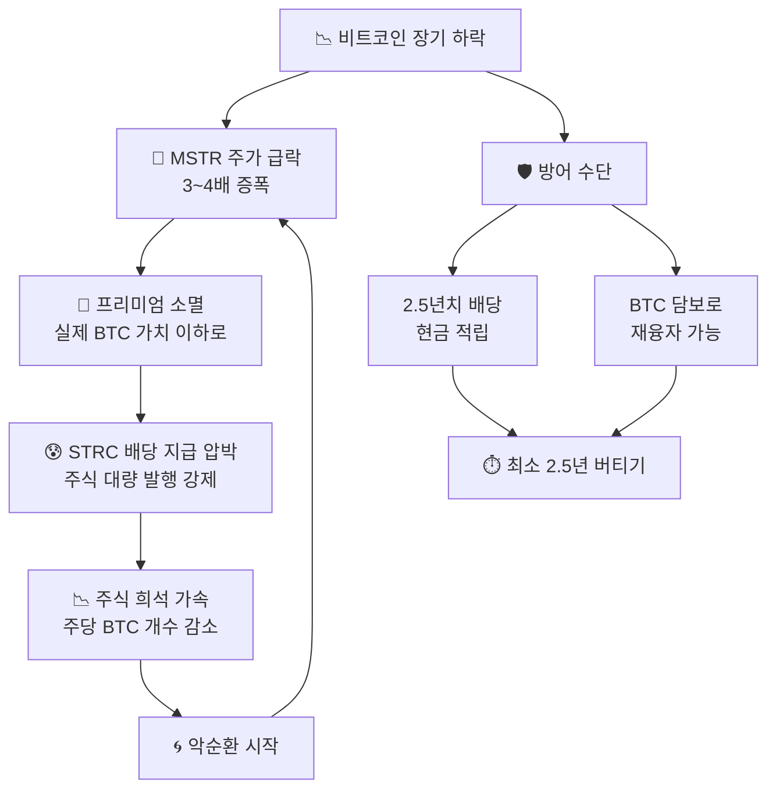

## ⚠️ 리스크 분석

MSTR 전략은 강력하지만 **비트코인이 장기 하락할 경우 심각한 위험**이 존재합니다.
반드시 이해하고 투자하세요.

::: warning
**⚠️ 투자 경고** — 이 페이지는 교육 목적이며 투자 권유가 아닙니다.
MSTR은 BTC 레버리지 투자로 상승폭만큼 하락폭도 크게 증폭됩니다.
:::

<!-- 강점/약점 2열 -->

  

    <h4>✅ 강점 (상승장)</h4>
    <ul>
      <li>BTC 상승의 3~4배 증폭</li>
      <li>2.5년치 배당금 선적립</li>
      <li>BTC Yield 지속 성장</li>
      <li>기관 투자 접근성 제공</li>
      <li>금리 인하 시 이중 혜택</li>
      <li>프리미엄으로 공짜 BTC 획득</li>
    </ul>
  

  

    <h4>⚠️ 약점 (하락장)</h4>
    <ul>
      <li>BTC 하락의 3~4배 증폭</li>
      <li>STRC 배당 지급 부담 지속</li>
      <li>프리미엄 급격히 소멸 가능</li>
      <li>장기 BTC 하락 시 파산 위험</li>
      <li>금리 인상 시 이중 압박</li>
      <li>주식 희석이 성장 초과 가능</li>
    </ul>
  

### 비트코인 하락 시 위험 시나리오

### MSTR이 파산을 막는 3가지 방어 수단

::: steps
1. **2.5년치 배당금 현금 적립**
   BTC가 폭락해도 2.5년간 배당을 현금으로 지급 가능. 즉각적 파산이 발생하지 않습니다.
2. **BTC 담보 재융자**
   보유 BTC를 담보로 새 채권을 발행해 기존 부채를 상환합니다.
3. **전환사채 만기 분산**
   채권 만기가 여러 해에 걸쳐 분산되어 있어 한꺼번에 상환해야 할 위험이 낮습니다.
:::

### 투자자 유형별 적합성

| 투자자 유형 | MSTR 적합성 | 이유 |
|----------|-----------|------|
| BTC 장기 강세론자 | **적합 ✅** | 레버리지로 BTC 수익 극대화 |
| 중립적 BTC 투자자 | 보통 ⚠️ | 직접 BTC ETF가 더 안전 |
| BTC 회의론자 | **비적합 ❌** | BTC 하락 시 손실 3~4배 증폭 |
| 단기 트레이더 | 주의 ⚠️ | 변동성 극심, 타이밍 중요 |

::: key
**💡 최종 결론** — MSTR은 **비트코인이 장기 우상향한다는 전제 하에 최적화**된 전략입니다.
이 전제가 틀린다면 레버리지는 수익이 아닌 손실을 증폭시킵니다.
비트코인의 장기 가치를 믿는 투자자에게만 적합한 **고위험 고수익 전략**입니다.
:::
