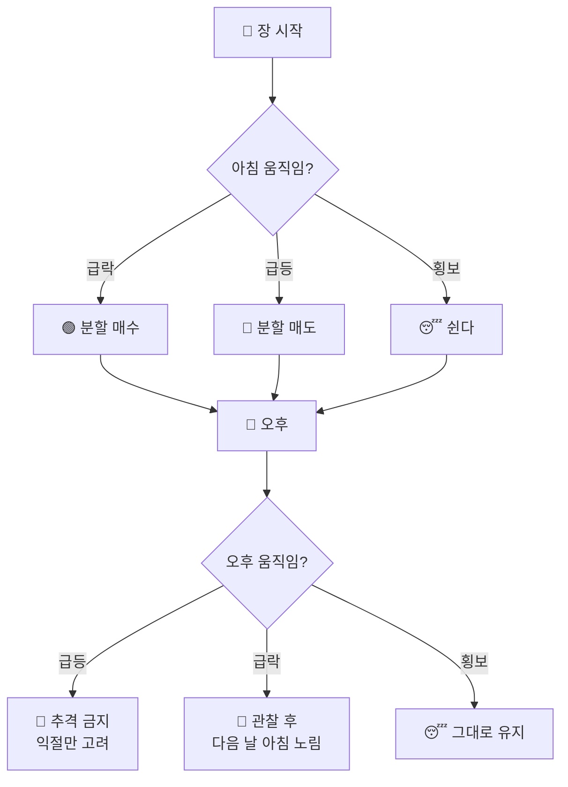

## 👴 일본 87세 현역 트레이더의 투자법

시장을 예측하지 않습니다. **시장의 감정을 거스르는 것**만으로 수십 년을 살아남은
일본 초고령 현역 트레이더의 매매 원칙 8가지를 정리했습니다.

::: key
**💡 핵심 철학** — "모두가 사고 싶어 안달할 때 팔고, 모두가 무서워 팔 때 산다."
맞히는 것이 아니라 **휩쓸리지 않는 것**이 실력입니다.
:::

### 8가지 매매 원칙

| # | 원칙 | 한 줄 요약 |
|---|------|-----------|
| 1 | 아침 급락 매수 / 아침 급등 매도 | 장 초반 과잉 반응을 역이용 |
| 2 | 오후 급등 추격 금지 / 오후 급락은 다음 날 | 오후의 흥분은 하루를 넘기지 않는다 |
| 3 | 공포에 팔지 않기 / 무동성 구간은 휴식 | 팔 자리가 아니면 쉬는 것도 매매 |
| 4 | 추격 안 함 · 급락 없으면 안 삼 · 횡보면 안 움직임 | 3무(無) 원칙 |
| 5 | 음봉에 사고 양봉에 판다 | 캔들 하나로 방향을 정한다 |
| 6 | 흐름에 휩쓸리지 말고 항상 반대를 노린다 | 역발상이 기본값 |
| 7 | 고점권·저점권 횡보에서는 기다림에 집중 | 조급함이 최대의 적 |
| 8 | 고점 횡보 후 한 단계 더 뛰면 즉시 익절 | 마지막 상승은 남에게 준다 |

### 하루의 매매 흐름

### 세 가지 축

::: steps
1. **시간대 원칙** — 아침과 오후는 성격이 다릅니다. 아침의 급변은 되돌리고, 오후의 급변은 이어집니다.
2. **캔들 원칙** — 음봉(내린 날)에 사고 양봉(오른 날)에 팝니다. 지표가 아니라 눈에 보이는 결과로 판단합니다.
3. **역발상 원칙** — 시장의 다수와 반대편에 섭니다. 추격하지 않고, 조급해하지 않고, 기다립니다.
:::

  

    <h4>✅ 이 방식의 장점</h4>
    <ul>
      <li>복잡한 지표·재무 분석이 필요 없음</li>
      <li>규칙이 단순해 감정 개입 여지가 적음</li>
      <li>고점 추격으로 인한 큰 물림을 원천 차단</li>
      <li>'쉰다'가 정식 선택지라 과매매를 막음</li>
    </ul>
  

  

    <h4>⚠️ 주의할 점</h4>
    <ul>
      <li>강한 추세장에서는 수익을 크게 놓칠 수 있음</li>
      <li>'급락'의 기준을 정해두지 않으면 규칙이 무너짐</li>
      <li>떨어지는 칼날에 손실이 누적될 위험</li>
      <li>단기 매매라 세금·수수료 부담이 큼</li>
    </ul>
  

::: warning
**⚠️ 반드시 함께 쓸 것** — 이 원칙에는 손절 규칙이 명시돼 있지 않습니다.
'급락 매수'는 하락 추세가 무한정 이어지면 치명적이므로,
**한 종목 최대 투입 비중**과 **최대 손실 한도**를 스스로 정해두고 적용하세요.
:::
