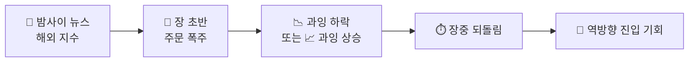

## 🌅 아침 매매법 — 급락에 사고 급등에 판다

::: warning
**원칙 1** — 아침에 급락하면 **매수**, 아침에 급등하면 **매도**.
**원칙 3** — 아침 급락에 **공포에 질려 팔지 않는다**. 움직임이 없을 때는 **쉰다**.
:::

### 왜 아침인가

장 시작 직후는 하루 중 **감정이 가장 과잉된 시간대**입니다.
밤사이 뉴스, 해외 지수, 미체결 주문이 한꺼번에 쏟아지며 실제 가치보다 크게 벗어난 가격이 만들어집니다.
이 왜곡은 대체로 장중에 되돌려집니다.

::: analogy 🧒 아침 시장 = 잠 덜 깬 사람
아침에 막 일어난 사람은 별것 아닌 일에도 화를 내고 깜짝 놀랍니다.
점심쯤 되면 "아까 왜 그랬지?" 하고 진정됩니다.
시장도 똑같습니다. 아침의 호들갑은 대부분 오후에 가라앉습니다.
:::

### 아침 상황별 행동

| 아침 움직임 | 행동 | 이유 |
|------------|------|------|
| **급락** | 분할 매수 시작 | 과잉 공포 → 되돌림 기대 |
| **급등** | 보유분 분할 매도 | 과잉 기대 → 되돌림 위험 |
| **횡보·무동성** | 아무것도 하지 않음 | 우위가 없는 구간, 수수료만 소모 |

### 공포에 팔지 않는다 (원칙 3)

아침 급락은 **매수 신호이지 매도 신호가 아닙니다.**
같은 하락을 보고 "무서워서 판다"와 "싸져서 산다"는 정반대 행동입니다.
이 방식에서는 후자만 허용됩니다.

::: info
**아침 급락에 하지 말아야 할 것**
- 손실 중인 보유 종목을 공포에 던지기
- 하한가 근처에서 전량 몰빵으로 받기
- "더 빠질까 봐" 매수 계획 자체를 취소하기

**해야 할 것** — 미리 정해둔 분할 매수 계획을 그대로 실행하기.
:::

### '쉰다'도 매매다

움직임이 없는 날은 우위가 없는 날입니다.
이때의 매매는 기대값이 0에 가깝고 수수료·세금만 남습니다.

::: key
**💡 핵심** — 아침의 급변은 **감정의 결과**이지 가치의 변화가 아닙니다.
감정이 만든 가격에는 반대로, 감정이 없는 시장(횡보)에는 손대지 않습니다.
:::
