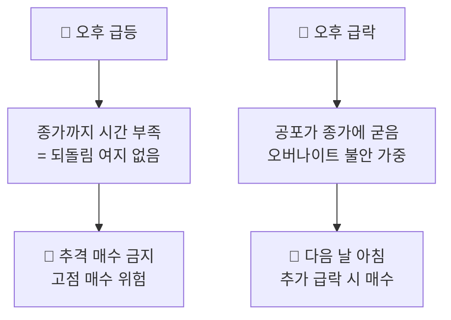

## 🌇 오후 매매법 — 추격하지 않고 다음 날을 노린다

::: warning
**원칙 2** — 오후의 급등은 **추격하지 않는다**.
오후에 급락하면 **다음 날 아침**을 노린다.
:::

### 오후는 아침과 성격이 다르다

아침의 급변은 되돌려지지만, 오후의 급변은 **되돌릴 시간이 없습니다.**
종가에 그대로 굳어 다음 날 시가로 이어지기 때문입니다.

### 오후 급등을 추격하면 안 되는 이유

| 위험 | 설명 |
|------|------|
| **되돌림 시간 부족** | 잘못 사도 당일 회복 기회가 없음 |
| **종가 관리성 상승** | 마감 직전 상승은 다음 날 그대로 이어지지 않는 경우가 많음 |
| **오버나이트 리스크** | 밤사이 해외 지수·뉴스에 그대로 노출 |
| **가장 비싼 가격** | 하루 중 최고가 부근에서 진입하게 됨 |

::: analogy 🧒 마감 직전 세일 줄서기
백화점 문 닫기 10분 전, 사람들이 몰려 값이 오른 물건을 급하게 삽니다.
다음 날 아침 매장에 가보면 그 물건은 원래 가격으로 돌아가 있습니다.
오후의 급등을 쫓는 것이 딱 이 모습입니다.
:::

### 오후 급락 → 다음 날 아침을 노린다

오후 급락은 그날 안에 소화되지 못하고 **공포가 종가에 그대로 남습니다.**
밤사이 불안이 커진 투자자들이 다음 날 시가에 투매를 쏟아내며,
이때 **원칙 1(아침 급락 매수)**이 발동할 최적의 자리가 만들어집니다.

::: steps
1. **당일 오후** — 급락을 확인해도 바로 사지 않고 관찰만 합니다. 종목과 하락 폭을 기록합니다.
2. **다음 날 시가** — 추가 급락으로 시작하는지 확인합니다. 갭 하락이면 1차 매수 자리입니다.
3. **분할 진입** — 한 번에 전량을 넣지 않고 정해둔 비중만큼만 나눠 담습니다.
4. **되돌림 확인** — 장중 반등이 나오면 계획한 구간에서 분할로 정리합니다.
5. **불발 시 철수** — 반등 없이 계속 밀리면 미리 정한 손실 한도에서 물러납니다.
:::

::: key
**💡 핵심** — 오후는 **진입하는 시간이 아니라 준비하는 시간**입니다.
오후에 본 것을 다음 날 아침에 실행합니다.
:::
