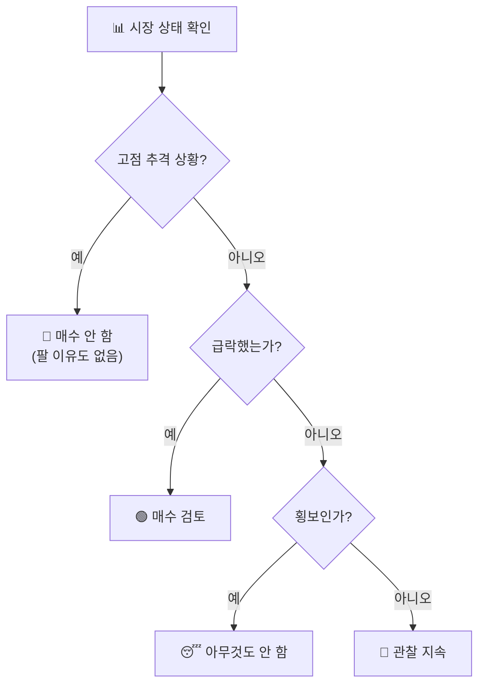

## 🚫 3무(無) 원칙 — 하지 않을 것을 먼저 정한다

::: warning
**원칙 4** — 고점을 추격하지 않으면 팔지 않고, 급락하지 않으면 사지 않으며, 횡보하면 움직이지 않는다.
:::

이 원칙은 "무엇을 살까"가 아니라 **"언제 손을 대지 않을까"**를 규정합니다.
매매 횟수를 줄이는 것 자체가 전략입니다.

### 세 가지 금지

| 상황 | 하지 않는 것 | 대신 하는 것 |
|------|-------------|-------------|
| **고점 추격 구간** | 뒤늦게 따라 사기 | 보유분 익절 자리만 계산 |
| **급락 없음** | 아무 자리에서나 매수 | 급락이 올 때까지 현금 대기 |
| **횡보** | 방향을 예측한 베팅 | 관찰·기록·휴식 |

::: analogy 🧒 낚시꾼의 하루
물고기가 안 보이는데 계속 낚싯대를 던지는 사람은 미끼만 잃습니다.
좋은 낚시꾼은 대부분의 시간을 **던지지 않고** 물을 봅니다.
입질이 올 때 딱 한 번 던집니다.
:::

### 매매 횟수와 손실의 관계

::: info
잦은 매매는 세 가지를 소모합니다.
- **수수료·세금** — 확정적으로 빠져나가는 비용
- **집중력** — 정작 좋은 자리가 왔을 때 판단이 흐려짐
- **자금** — 애매한 자리에 물려 급락 매수 기회에 쓸 현금이 없어짐

이 방식이 '쉬는 것'을 원칙으로 못 박은 이유가 여기에 있습니다.
:::

### 자기 점검 질문

::: steps
1. **지금 사려는 이유가 '급락'인가?** — 아니라면 사지 않습니다.
2. **지금 팔려는 이유가 '급등·익절'인가?** — 공포 때문이라면 팔지 않습니다.
3. **오늘 시장이 움직이긴 했는가?** — 횡보였다면 오늘 매매는 없어야 정상입니다.
4. **어제도 오늘도 매매했는가?** — 연속 매매는 규칙이 아니라 습관일 가능성이 큽니다.
:::

::: key
**💡 핵심** — 이기는 매매의 반대말은 지는 매매가 아니라 **불필요한 매매**입니다.
3무 원칙은 그 불필요한 매매를 제거하는 필터입니다.
:::
