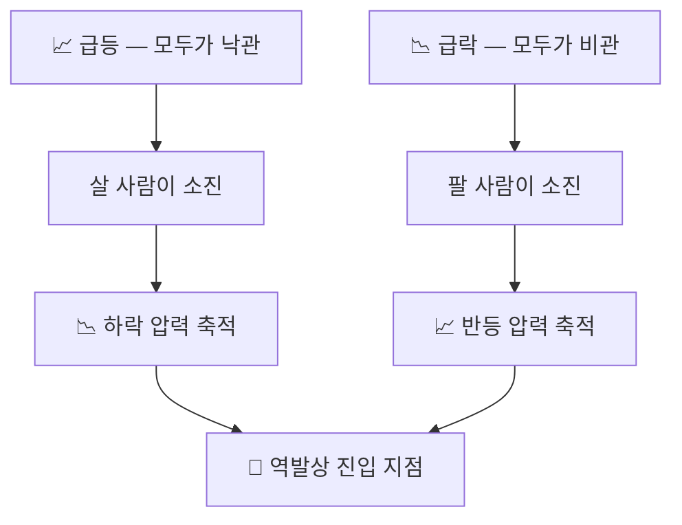

## 🔄 역발상 — 항상 시장의 반대를 노린다

::: warning
**원칙 6** — 시장의 흐름에 휩쓸리지 마라. 항상 **'반대'**를 노려라.
:::

### 왜 반대인가

가격이 급등했다는 것은 **살 사람이 이미 다 샀다**는 뜻이고,
급락했다는 것은 **팔 사람이 이미 다 팔았다**는 뜻입니다.
남은 힘은 언제나 반대 방향에 있습니다.

::: analogy 🧒 만원 버스
사람이 꽉 찬 버스에는 더 탈 수 없습니다. 이제 내리는 일만 남았습니다.
텅 빈 버스에는 내릴 사람이 없습니다. 이제 타는 일만 남았습니다.
시장의 낙관과 비관도 똑같이 정원이 있습니다.
:::

### 다수와 반대편에 서기

| 시장 분위기 | 다수의 행동 | 이 방식의 행동 |
|------------|-----------|--------------|
| 연일 신고가·낙관 뉴스 | 추격 매수 | 분할 매도·현금 확보 |
| 폭락·공포 뉴스 | 투매 | 분할 매수 |
| 지루한 횡보 | 다른 종목으로 이동 | 그대로 기다림 |

### 역발상은 '무조건 반대'가 아니다

::: info
역발상의 조건은 **감정의 과잉**이지 단순한 방향이 아닙니다.

- ✅ **역발상이 통하는 경우** — 뉴스·공포·기대에 의한 단기 과잉 반응
- ❌ **역발상이 위험한 경우** — 실적 훼손, 상장 폐지 위험, 구조적 쇠퇴처럼 **가치 자체가 변한 하락**

가격만 보고 반대에 서면 안 되고, **왜 움직였는지**를 먼저 구분해야 합니다.
:::

### 감정을 거스르는 훈련

::: steps
1. **매매 전 기록** — 지금 사려는(팔려는) 이유를 한 문장으로 적습니다.
2. **감정어 검사** — 그 문장에 '무서워서', '놓칠까 봐'가 들어 있으면 실행하지 않습니다.
3. **규칙 대조** — 원칙 1~5 중 어디에 해당하는지 확인합니다. 해당 없으면 매매하지 않습니다.
4. **사후 복기** — 규칙을 지켰는지만 채점합니다. 수익 여부는 채점 대상이 아닙니다.
:::

::: key
**💡 핵심** — 역발상은 배짱이 아니라 **절차**입니다.
남들과 반대로 움직이는 용기는 미리 정해둔 규칙에서 나옵니다.
:::
