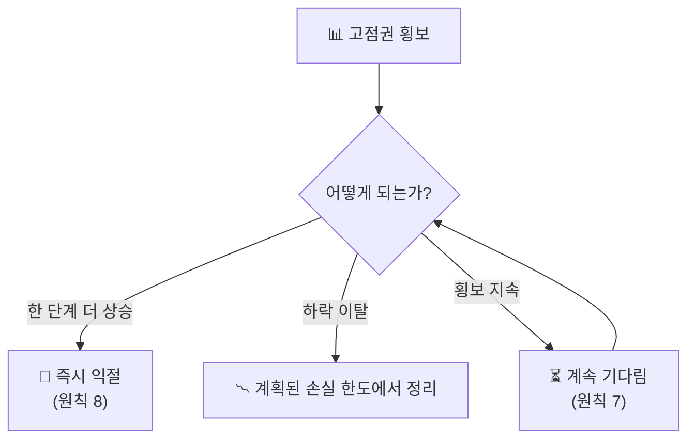

## ⏳ 기다림과 익절 — 횡보에서 버티고 한 단계 더에서 판다

::: warning
**원칙 7** — 고점권·저점권에서 횡보할 때는 조급해하지 말고 **'기다림'**에 집중한다.
**원칙 8** — 고점에서 횡보하다가 **'한 단계 더'** 뛰어오르면 망설이지 말고 **수익을 확정**한다.
:::

### 횡보는 결정이 유예된 구간

고점권·저점권의 횡보는 매수세와 매도세가 팽팽히 맞선 상태입니다.
방향이 정해지지 않았으므로 **어느 쪽에 걸어도 확률은 반반**입니다.
이 구간에서 움직이는 것은 매매가 아니라 도박입니다.

| 구간 | 조급한 행동 | 올바른 행동 |
|------|-----------|-----------|
| **고점권 횡보** | "더 오를 것 같아" 추가 매수 | 익절 가격만 정해두고 대기 |
| **저점권 횡보** | "안 오르네" 손절 후 이탈 | 보유 유지, 추가 급락 시에만 매수 |
| **방향 이탈 직후** | 뒤늦게 따라붙기 | 미리 정한 규칙대로 실행 |

::: analogy 🧒 물이 끓기 전
냄비 뚜껑을 자꾸 열어보면 물은 더 늦게 끓습니다.
불을 올렸다 내렸다 하면 아예 안 끓습니다.
할 일은 불을 켜둔 채 **기다리는 것**뿐입니다.
:::

### '한 단계 더'가 익절 신호인 이유

고점에서 오래 횡보하던 종목이 한 단계 더 뛰어오르는 것은
대개 **마지막에 들어온 매수세**가 만든 움직임입니다.
더 살 사람이 남지 않은 자리이므로, 여기가 파는 자리입니다.

::: info
**익절을 미루게 만드는 생각들**
- "여기서 팔면 더 갈 텐데" → 마지막 상승은 원래 남의 몫입니다.
- "본전만 더 넘으면" → 본전은 시장이 알아주는 기준이 아닙니다.
- "조금만 더 보고" → 횡보 후 급등은 되돌림도 빠릅니다.

**망설임을 없애는 방법** — 횡보 구간에서 **미리 익절 가격을 적어두고**,
도달하면 판단 없이 실행합니다.
:::

### 기다림·익절 체크리스트

::: steps
1. **횡보 진입 확인** — 고점권인지 저점권인지 먼저 구분합니다.
2. **익절가 사전 기록** — 고점권이면 '한 단계 더' 지점을 숫자로 적어둡니다.
3. **손실 한도 사전 기록** — 하락 이탈 시 물러날 지점도 함께 적습니다.
4. **횡보 중 무행동** — 두 지점 중 하나에 닿기 전까지는 아무것도 하지 않습니다.
5. **도달 시 즉시 실행** — 도달하는 순간 재해석하지 않고 그대로 실행합니다.
:::

::: key
**💡 핵심** — 기다림은 소극적인 태도가 아니라 **가장 확률이 높은 자리를 고르는 작업**입니다.
그리고 그 자리가 왔을 때는 망설이지 않는 것이 짝을 이룹니다.
:::
